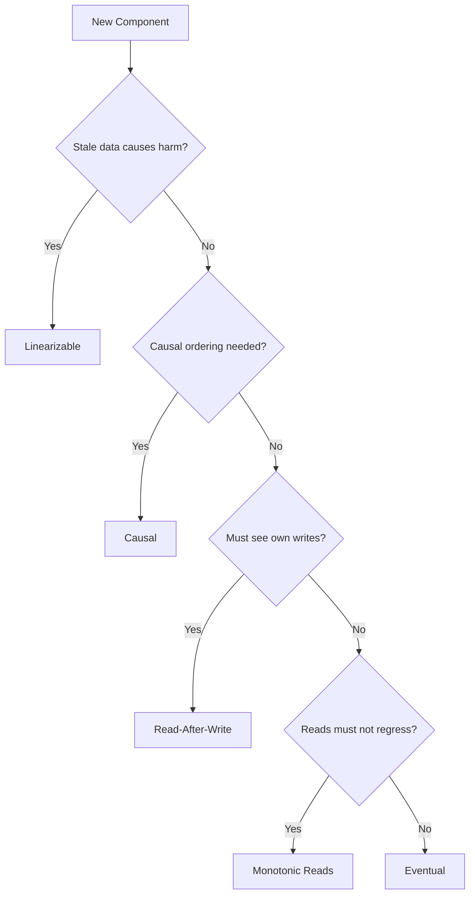
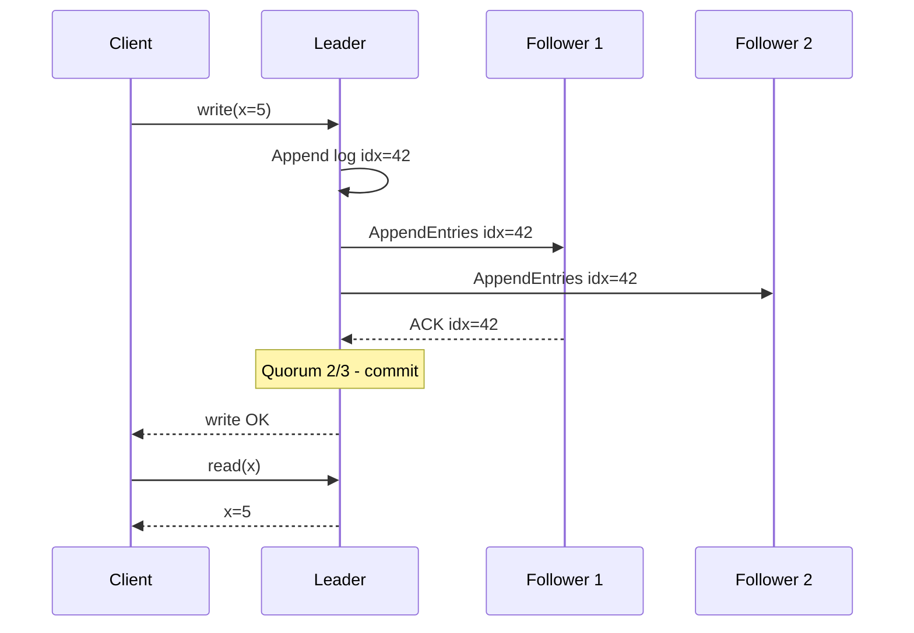

<!-- tldr -->
# Consistency Models

A consistency model is a formal contract between a distributed storage system and its clients: after a write completes, it defines exactly what any subsequent read is guaranteed to return. Because replication takes time and networks partition, replicas inevitably diverge temporarily — the model defines the rules governing that divergence. Stronger models eliminate anomalies at the cost of latency and availability; weaker models maximize throughput while shifting anomaly-handling onto the application.


<!-- standard -->

## The Consistency Spectrum

Each model relaxes exactly one constraint from the model above it. Assign the right model per **component**, not per system.

- **Linearizable** — Every operation appears to execute atomically at one point in real time. If write A completes before read B starts, B must see A's value. Requires global coordination (consensus or quorum reads). Use for: distributed locks, inventory, financial balances.
- **Sequential** — All operations appear in one consistent global order that respects each client's own order, but not wall-clock time. Common in CPU memory models; rarely chosen explicitly in distributed systems — most teams go linearizable or eventual.
- **Causal** — Operations causally related (same client, or B read a value written by A) appear in causal order everywhere. Concurrent, unrelated operations may appear in any order. Use for: comment threads, social feeds, collaborative edits.
- **Read-After-Write (RAW)** — A client always sees the effects of its own completed writes, regardless of which replica serves the read. Use for: user profiles, shopping cart, settings toggles.
- **Monotonic Reads** — Once a client has seen version V, it never sees an older version. Prevents time-reversal in pagination and polling.
- **Eventual** — All replicas converge to the same value if writes stop. No bound on when. Convergence in practice: 10–100ms same-DC, 100ms–2s cross-region. Use for: DNS, caches, like counts, recommendation feeds.

### Model Comparison

| Model | Core Guarantee | Write Latency | Availability Under Partition |
|---|---|---|---|
| Linearizable | See latest write globally | High (5–400ms) | Reduced — must refuse or block |
| Sequential | Consistent global order, not real-time | Medium | Medium |
| Causal | Causal order preserved | Low | High |
| Read-After-Write | See your own writes | Low | High |
| Monotonic Reads | Never read an older version | Low | High |
| Eventual | Replicas converge eventually | Lowest | Highest |

### Model Selection Flowchart



<!-- deep -->

## Algorithms and Mechanisms

### Linearizability via Raft

Raft achieves linearizability through a single leader receiving all writes, replicating to a quorum of followers, then committing. Reads from followers are stale without additional coordination.

**Write path — 3-node cluster:**
1. Client sends `write(x=5)` to leader
2. Leader appends entry at log index N
3. Leader sends `AppendEntries(N, x=5)` to both followers in parallel
4. Wait for ACK from ≥1 follower (quorum = 2/3)
5. Commit, reply to client

**Linearizable read — two options:**
- **Leader read with lease**: Leader checks it's still elected within its heartbeat lease window (bounded by max clock drift). If confirmed, serves read locally. Avoids extra RTT. Risk: clock drift can cause a deposed leader to serve stale data during the lease window.
- **Quorum read**: Read from ≥ ⌈(N+1)/2⌉ nodes, return the value with the highest version. Adds 1 RTT but is unconditionally safe.



### Causal Consistency via Vector Clocks

Each node maintains a vector clock `[n1, n2, ..., nN]`. Every write carries the writer's current vector. A receiving node buffers the write until all causally prior writes have arrived, then delivers in order.

```
N1 writes x=5   → VC: [1,0,0]
N2 reads x=5, writes y=10  → VC: [1,1,0]  (causally depends on N1's write)
N3 receives y=10 with VC=[1,1,0]:
  If N3 already has x=5 (VC [1,0,0]) → deliver y=10 immediately
  If N3 has not yet received x=5    → buffer y=10 until x=5 arrives
```

**Overhead**: O(N) integers per message — 100 nodes = ~800 bytes metadata. Hybrid Logical Clocks (HLC) compress causal history to a single scalar + counter for most practical deployments. MongoDB uses cluster time + session tokens; Facebook IGTV uses custom HLC-based causal delivery.

### Read-After-Write Implementation Techniques

| Technique | Mechanism | Downside |
|---|---|---|
| Sticky sessions | Consistent hash routes user to same replica | Breaks on replica failure |
| Read from primary | User's own data always reads from leader | Leader hot-spots for power users |
| Version-tagged reads | Write returns `v=347`; client sends `read @v>=347`; replica waits | Slow replicas add tail latency |

The version-tag approach is the most robust. DynamoDB implements it via `ConsistentRead` flag; MongoDB implements it via session-level cluster time vectors.

### Conflict Resolution in Eventual Consistency

When two replicas accept concurrent writes to the same key, convergence requires a deterministic resolution:

| Strategy | Mechanism | Data Loss Risk | Suitable For |
|---|---|---|---|
| Last-Write-Wins (LWW) | Highest timestamp wins | Yes — clock skew drops writes | Low-contention keys |
| Version Vectors | Track per-replica versions; app resolves siblings | No | Any mutable object |
| CRDTs | Commutative merge (G-Counter, OR-Set, LWW-Register) | No | Counters, sets, flags |

Cassandra defaults to LWW. DynamoDB Streams + application logic implements version vectors. Riak popularized CRDTs; Redis 7+ includes a CRDT module.

---

## Real-World Systems

| System | Default Model | Strongest Available | Key Mechanism |
|---|---|---|---|
| **DynamoDB** | Eventual (1 RCU) | Linearizable per key (2 RCU) | `ConsistentRead=true` → leader read |
| **Cassandra** | Eventual (`ONE`) | Linearizable via LWT (`SERIAL`) | Paxos per partition for lightweight txn |
| **etcd** | Linearizable | Linearizable | Raft; used for Kubernetes control plane |
| **Google Spanner** | External consistency | External consistency | TrueTime GPS/atomic clocks; ε ≈ 7ms |
| **MongoDB** | Eventual (secondary reads) | Causal sessions | Cluster time + session causality tokens |
| **Kafka** | Sequential per partition | Sequential per partition | Log offset ordering; no cross-partition guarantee |
| **Redis Cluster** | Eventual | Eventual + LWW | `WAIT N TIMEOUT` for semi-sync replication |
| **CockroachDB** | Serializable | Serializable | HLC + Raft per range |

**Spanner's TrueTime** bounds clock uncertainty to ε ≈ 7ms globally (GPS receivers + atomic clocks in each DC). Spanner waits 2ε before committing, guaranteeing external consistency across continents at ~14ms added commit overhead — the only production system to achieve global linearizability at scale without a single global leader.

**Kafka cross-partition caveat**: An order-created event in partition 0 and a payment-processed event in partition 1 have no ordering guarantee at the consumer. If downstream services depend on causal ordering across topics, you must embed a causal token (e.g., order version) in the payment event and have the consumer wait for the order event before processing payment.

---

## Failure Modes

**Stale primary reads after failover**  
MySQL semi-sync or Postgres streaming replication: a newly promoted primary may not have received all writes from the old primary. Applications that immediately route reads to "the new primary" observe data rollback. Mitigate with GTID-based fencing: refuse reads until the replica has caught up to the last acknowledged GTID.

**Split-brain violating linearizability**  
A network partition causes two nodes to each believe they are leader. Both accept writes; on heal, conflict arises with no way to order the concurrent writes. Raft/Paxos majority quorum prevents two concurrent leaders by construction. For systems without consensus, use fencing tokens: the primary's write includes a monotonically increasing epoch; any node with a lower epoch rejects writes.

**Clock skew defeating LWW**  
Client A's clock is 200ms ahead of Client B. Client B's write arrives 100ms after Client A's, but A's wall-clock timestamp is larger → A "wins" even though B wrote later. Impact: silent data loss. Mitigate with HLC (Hybrid Logical Clocks) or version vectors instead of wall-clock timestamps for LWW.

**Replication lag spike under write burst**  
At 50k 2KB writes/s = 100 MB/s replication throughput. If a follower saturates its network or I/O, lag spikes from 20ms to 30s — turning "eventual consistency with <1s window" into "surprisingly stale." Monotonic read guarantees silently break if different requests hit different replicas. Alert on `replica_lag_seconds > 5s`; throttle ingress writes above the SLO threshold.

**Cross-service RAW violation (phantom stale read)**  
Service A writes to DB → emits Kafka event → Service B consumes event → reads DB. If B's DB read hits a replica not yet caught up to A's write, B sees stale data despite A's write being committed. The write is causally prior to B's read, but B skipped the causal dependency. Fix: include the DB write version in the Kafka message; Service B's consumer waits for that version before issuing its read.

---

## Capacity and Latency Numbers

| Operation | P50 Latency | P99 Latency | Notes |
|---|---|---|---|
| Raft write, intra-DC (3-node) | 2–5ms | 10ms | Same availability zone |
| Raft write, cross-region US-E ↔ US-W | 150–200ms | 350ms | ~70ms RTT × 2 + processing |
| DynamoDB strongly consistent read | ~1ms | ~5ms | Leader read, costs 2× RCU |
| DynamoDB eventually consistent read | ~0.5ms | ~3ms | Any replica, 1× RCU |
| Cassandra `LOCAL_QUORUM` read | 1–5ms | 15ms | Same-DC quorum |
| Cassandra `ONE` read | 0.5–2ms | 5ms | Nearest single replica |
| Cassandra LWT (`SERIAL`) write | 10–25ms | 50ms | Paxos round per partition |
| Same-DC async replication lag | 10–100ms | 500ms | Under normal load |
| Cross-region async replication lag | 100ms–1s | 5s | Normal load; unbounded on partition |
| Spanner external-consistency commit | 10–20ms | 50ms | Includes 2ε TrueTime wait |

**Throughput ceiling for linearizable writes**: Each write burns 1 consensus round-trip. At 5ms/round-trip intra-DC, a single Raft group handles ~200 linearizable writes/s before pipelining. etcd benchmarks with pipelining show ~10k writes/s on a 3-node cluster at P99 < 20ms. Partition data across independent Raft groups (as CockroachDB and TiKV do) to scale linearly.

---

## Interview Pitfalls

**1. Confusing linearizability with serializability**  
Serializability is an isolation level for multi-object *transactions*: concurrent transactions appear to execute in some serial order. Linearizability is a *single-object* consistency model: each operation appears instantaneous. Strict serializability = serializable transactions + real-time ordering. Spanner provides strict serializability. PostgreSQL's `SERIALIZABLE` isolation provides serializability but not linearizability for single-key operations across concurrent transactions without additional coordination.

**2. "Reading from the primary gives linearizability"**  
A primary that has been deposed but hasn't yet discovered it (due to network partition or GC pause) serves stale reads. Proper linearizable reads require either lease-based reads (leader verifies it's still leader within a clock-drift-bounded window) or quorum reads. Simply routing to a host tagged "primary" in service discovery is not sufficient.

**3. "Eventual consistency is a problem to be solved"**  
The correct framing: identify which operations require strong consistency, apply it there, and use eventual consistency everywhere else. For most user-facing features the convergence window is <1s — invisible to humans. Applying linearizability to social like-counts or recommendation feeds wastes 5–10× latency for zero user-visible benefit.

**4. Cassandra `QUORUM` does not mean linearizable**  
`QUORUM` reads in Cassandra read from a majority of replicas and return the value with the latest timestamp. But two concurrent writers and a concurrent `QUORUM` read can still return a stale value if the quorum intersects the "not yet propagated" set. Only `LOCAL_SERIAL` / `SERIAL` with Paxos provides linearizability in Cassandra — at ~5× write latency overhead. Know this distinction before citing Cassandra in a design.

**5. Forgetting that session guarantees require client-side enforcement**  
A round-robin load balancer destroys read-after-write and monotonic read guarantees by routing successive requests to different replicas with different lag. Sticky routing (consistent hash on user ID), version tokens in cookies, or client-library session objects (MongoDB `ClientSession`, Cassandra `ExecutionProfile`) are all required to re-establish these guarantees after the database layer provides them.

---

## Decision Rubric: When to Reach for Each Model

**Linearizable** — Incorrect data causes financial loss, overselling, security breach, or split-brain. You can tolerate 5–400ms write latency and CP behavior under partition. Target: distributed locks (`etcd`), inventory counters, payment deduplication, leader election, configuration stores.

**Causal** — Feature involves user-generated relationships where ordering matters (reply to a post, reaction to a message, episode 2 after episode 1 in a watch history). You want coherent UX without cross-datacenter coordination. Target: social comment threads, collaborative documents, event-sourced microservices passing causal tokens in messages.

**Read-After-Write** — The writing user must immediately see the result of their own mutation. Other users seeing stale data for <1s is acceptable. Target: profile updates, shopping cart mutations, toggle/preference changes, form submission redirects. Implement via version tokens or sticky routing.

**Monotonic Reads** — Clients paginate, poll for status, or stream data and must not observe time-reversal. Implement via session-pinned replicas or `read-after-version` requests. Target: cursor-based list APIs, job-status polling, leaderboard pages.

**Eventual** — Feature tolerates staleness within the convergence window (<1s same-DC, <5s cross-region). You need maximum throughput, CDN-cacheable responses, or write availability during partitions. Target: DNS, CDN-served content, social feed counters, recommendation scores, analytics pipelines, product catalog reads. Default choice unless a specific anomaly forces a stronger model.