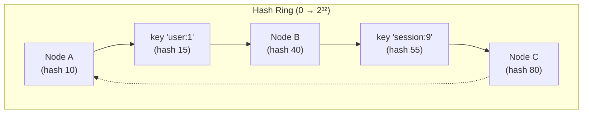

<!-- tldr -->
# Consistent Hashing

Ordinary modular hashing (`key mod n`) breaks whenever `n` changes: add or remove one server and nearly every key maps to a different node, triggering a thundering-herd cache miss storm. Consistent hashing solves this by placing both keys and nodes on a conceptual ring (hash space 0 → 2³²). Each key is owned by the first node clockwise from its hash position. Add a node — only keys between the new node and its predecessor move. Remove a node — its keys absorb into the next clockwise neighbour. Expected rebalancing is **1/n** of the keyspace regardless of ring size.



<!-- standard -->

## What It Is

A distributed hashing scheme that maps both servers and data keys onto a fixed-size circular hash space (a "ring"). Each data item is assigned to the first server encountered when traversing the ring clockwise from the item's hash position.

**Core invariant:** when a node joins or leaves, only keys in the arc between the affected node and its predecessor on the ring are reassigned.

### Key Operations

| Operation | Naive mod-n hashing | Consistent hashing |
|---|---|---|
| Add node | Remap ~all keys | Remap ~1/n keys |
| Remove node | Remap ~all keys | Remap ~1/n keys |
| Lookup | O(1) | O(log n) with sorted ring |

## Virtual Nodes (vnodes)

A major weakness of basic consistent hashing: with real servers the ring partition is highly non-uniform — one node may own 40% of keys, another 5%. The fix is **virtual nodes**: each physical server is hashed multiple times (e.g., 150 vnodes per server), creating a statistically uniform distribution.

Benefits:
- Load variance across nodes drops from O(log n) to O(1/√(vnodes per server))
- Heterogeneous hardware: give a 2× larger server 2× as many vnodes
- Graceful failure: a dead server's keys spread across many survivors, not just one

The **bounded-load consistent hashing** variant (Google, 2017) adds a cap `(1 + ε)` times the average load per node, rejecting requests to overloaded nodes to enforce near-perfect balance. The (1+ε) parameter is typically 1.25.

## Where It Shows Up in Practice

- **Distributed caches:** Memcached, Redis Cluster, Twemproxy — each client maps keys to shards without a central broker
- **Distributed databases:** Cassandra, DynamoDB, Riak use consistent hashing to partition the token ring
- **CDN edge selection:** Akamai-style systems place users and PoPs on a ring to minimize cross-region hops
- **Load balancers:** session affinity without a sticky-session table

## Common Interview Mistakes

1. **Forgetting vnodes.** Saying "use consistent hashing" without virtual nodes means non-uniform load — an interviewer will probe this.
2. **Claiming O(1) lookup.** Basic ring lookup is O(n) without a sorted structure; binary search gives O(log n).
3. **Missing the hot-key problem.** Consistent hashing distributes *keys* uniformly, not *load*. A viral key still hammers one node. The fix is replication of hot keys, not more vnodes.
4. **Ignoring clock skew in membership changes.** If two nodes simultaneously detect a third node leaving, they may disagree on which owns the relinquished arc. Gossip protocols handle this but add complexity.

<!-- deep -->

## Bounded-Load Consistent Hashing

Google's 2017 paper ("Consistent Hashing with Bounded Loads") introduces a load-aware variant that provably keeps every node's load within a factor (1+ε) of the average, while maintaining O(log n) lookup:

**Algorithm sketch:**
1. Compute `capacity = ⌈ (1+ε) × total_requests / n ⌉`
2. Hash the key; probe clockwise until you find a node with `current_load < capacity`
3. The worst-case probe length is O(log n) with high probability

The practical ε is 0.25 (25% above average). This is deployed in Google's internal load balancer and open-sourced as part of `go-jump-consistent-hash`.

### Rendezvous Hashing (HRW)

An alternative to ring-based consistent hashing:
- For each candidate node, compute `score = hash(key, node_id)`
- Assign the key to the node with the highest score
- No ring required; trivially handles node weights by scaling scores
- Downside: O(n) lookup when node set is large — unsuitable for n > ~1000

### Jump Consistent Hash

Google's `JumpConsistentHash(key, num_buckets)` produces a bucket in [0, num_buckets) in O(log n) with zero memory overhead:

```go
func JumpConsistentHash(key uint64, numBuckets int) int32 {
    var b, j int64 = -1, 0
    for j < int64(numBuckets) {
        b = j
        key = key*2862933555777941757 + 1
        j = int64(float64(b+1) * (float64(int64(1)<<31) / float64((key>>33)+1)))
    }
    return int32(b)
}
```

Zero allocation, no ring structure, excellent uniformity. Limitation: only supports adding nodes at the high end — can't remove an arbitrary node without relabelling all nodes after it.
