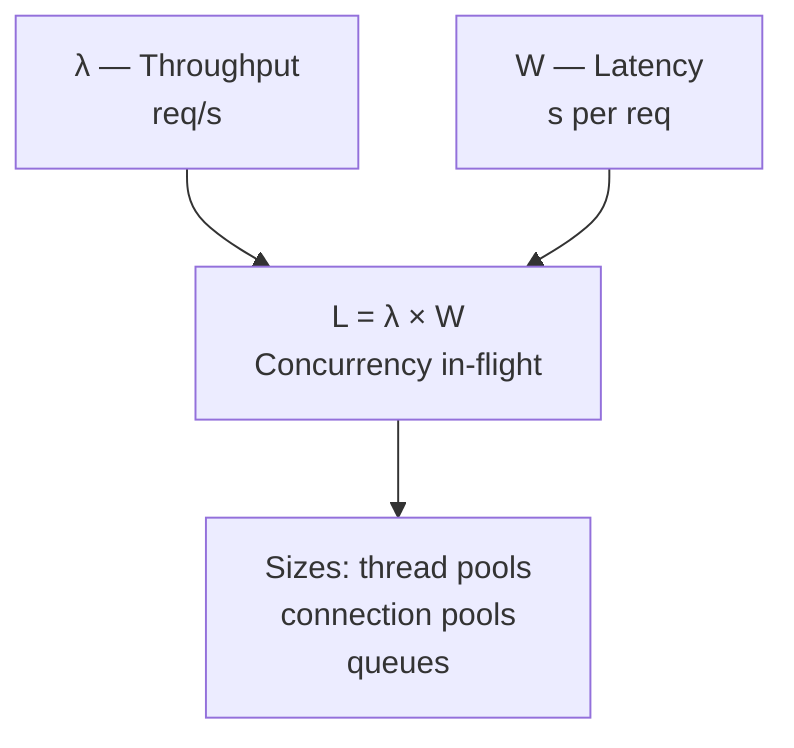
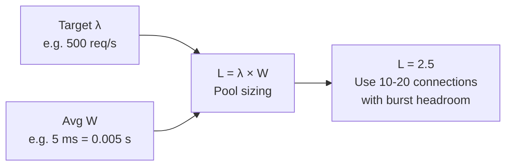
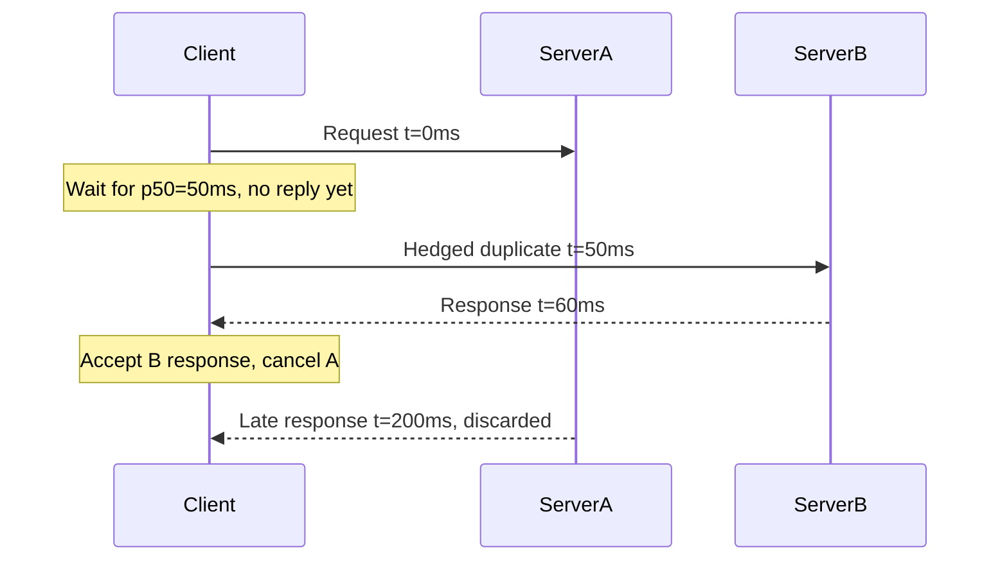
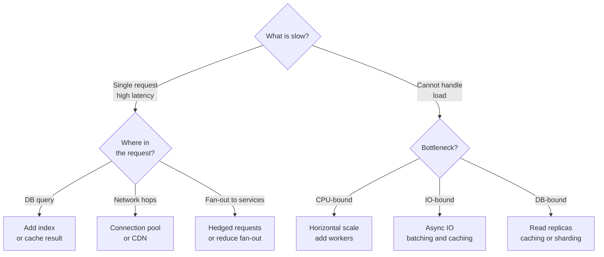

<!-- tldr -->
# Latency and Throughput

Latency is how long one request takes end-to-end; throughput is how many requests the system completes per second. They are related but not inverses: the same 10 ms per-request latency can deliver 100 req/s on one worker or 100,000 req/s on 10,000 workers. Little's Law — **L = λ × W** — connects all three, letting you size thread pools, connection pools, and queues from first principles.



<!-- standard -->

## What It Is and Why It Matters

**Latency** — experienced by one user — is measured in milliseconds or microseconds. **Throughput** — experienced by all users simultaneously — is measured in requests, operations, or bytes per second. When a user says "the app feels slow," that's a latency complaint. When your system falls over under load, that's a throughput problem. Good design keeps both in check.

The connecting concept is concurrency: `Throughput = Concurrency / Latency`. To increase throughput without changing per-request latency, add parallel workers. To increase throughput without adding workers, reduce latency. Both levers are real and distinct.

## Why Averages Lie

| Measurement | Value | What It Hides |
|---|---|---|
| Mean (99 × 50 ms + 1 × 5,000 ms) / 100 | 99.5 ms — looks green | 1 user in 100 waiting 5 s |
| p50 | 50 ms | — |
| p99 | 5,000 ms | Exposes the real tail |

At 1 M requests/day, 1% = **10,000 users/day** experiencing the worst case. Design SLOs around **p99**, not means. One subtle trap: you cannot average percentiles across servers. If Server A has p99 = 200 ms and Server B has p99 = 400 ms, the system p99 is not 300 ms. Use histogram merging (HdrHistogram, t-digest) or a platform that handles it correctly — Prometheus histograms, Datadog, Honeycomb.

## Primary Optimization Techniques

- **Caching** — 40 ms DB query → 1 ms Redis lookup; >90% hit ratio cuts DB load by 10×.
- **Connection pooling** — eliminates ~95 ms of TCP + TLS handshake overhead per request; use PgBouncer for Postgres.
- **Database indexing** — full-table scan on 1 M rows: 40–500 ms; B-tree index: 1–5 ms.
- **Payload compression** — Gzip/Brotli: 5–10× size reduction; CPU cost is negligible above ~1 KB.
- **CDN** — 150 ms cross-continent RTT → 5–15 ms edge response for cacheable content.

## The Core Trade-off: Batching

| Mode | Batch size | p50 latency | Throughput |
|---|---|---|---|
| Low-latency (poll every 10 ms) | 1 msg | ~15 ms | 66 msg/s |
| High-throughput (poll every 1 s) | 100 msgs | ~1,000 ms | ~1,000 msg/s |

Use high-throughput batching for analytics pipelines, ETL, and audit logging. Never batch user-facing or time-sensitive operations (payments, real-time notifications). If a user doesn't need to see the result immediately, make the work asynchronous and queue it — this improves API latency and lets the background work scale independently.



<!-- deep -->

## Hardware Latency Numbers You Must Know

Every architectural decision is an implicit claim about these numbers.

| Operation | Latency | Relative to RAM |
|---|---|---|
| L1 cache read | 0.5 ns | 0.005× |
| L2 cache read | 7 ns | 0.07× |
| RAM read | 100 ns | baseline |
| SSD random read | 150 μs | 1,500× |
| Intra-datacenter RTT | ~500 μs | 5,000× |
| Redis GET (network) | ~1 ms | 10,000× |
| Indexed DB query | 1–5 ms | 10,000–50,000× |
| HDD seek | 10 ms | 100,000× |
| Cross-continent RTT | ~150 ms | 1,500,000× |

Three things to internalize: (1) RAM is 1,500× faster than SSD — keep hot data there via caching. (2) A 10-hop sequential microservice chain costs ≥5 ms in network overhead before any computation runs. (3) No code optimization beats geography — CDNs and multi-region deployments are the only fix for cross-continent latency; the speed of light is a hard constraint.

## Tail Latency Amplification

### The Math

When a request fans out to N independent downstream services each at p99 = X:

```
P(all N respond fast) = 0.99^N
P(at least one is slow) = 1 − 0.99^N
```

| Fan-out N | Slow-request probability |
|---|---|
| 1 | 1.0% |
| 3 | 2.97% |
| 10 | 9.6% |
| 50 | 39.5% |

A monolith tuned to p99 = 50 ms degrades to ~p90 = 50 ms once it fans out to ten microservices. This is the most underappreciated cost of service decomposition. Every service added to a fan-out chain raises the probability that the overall request will be slow.

### Mitigation: Hedged Requests (Dean & Barroso, Google 2013)

Send a request to one server; if it hasn't responded by p50 (i.e., it is already slower than half of all requests), send a duplicate to a second server. Use whichever responds first; cancel the other.



**Cost:** ~5% extra traffic (only tail requests get duplicated). **Benefit:** p99 drops from ~500 ms → ~80 ms.

### Mitigation: Deadline Propagation

Attach a shrinking time budget to every inter-service call. gRPC implements this natively as a context deadline. Without it, a client that has already timed out still drives downstream computation — wasted resources with zero user benefit.

```
Client budget: 500 ms
  → Service A: uses 50 ms, forwards 450 ms remaining
    → Service B: uses 100 ms, forwards 350 ms remaining
      → Service C: budget exhausted → return cached or degraded response immediately
```

## Little's Law: The Equation Behind Every Queue

`L = λ × W` applies to any stable queuing system. Using it to make concrete decisions:

- **Size a DB connection pool:** want 500 qps at 5 ms avg query time → L = 500 × 0.005 = 2.5 connections on average → set pool to 10–20 with burst headroom. Teams that set pools of 100+ often *reduce* throughput by overwhelming the database with connection overhead.
- **Find saturation:** if L (in-flight requests) is growing while W and λ are stable, arrivals exceed service capacity — you are past saturation.
- **Capacity planning:** a server handling 200 concurrent connections at 50 ms average latency → max throughput = 200 / 0.05 = **4,000 req/s per server**.

## Real-World Systems

### Cassandra
`LOCAL_QUORUM` reads fan out to the nearest quorum of replicas and complete when the fastest majority responds. Speculative retries (`speculative_retry` policy, default `99PERCENTILE`) implement hedging natively. Expected p99 for key-value reads on hot data: **1–5 ms**.

### Kafka
`linger.ms` (default 0 ms) controls producer-side batching. Setting it to 5–50 ms improves throughput 10–100× at the cost of that exact added producer latency. `fetch.min.bytes` / `fetch.max.wait.ms` apply the same trade-off on the consumer side. Latency and throughput are explicit, tunable knobs — Kafka makes the trade-off visible.

### DynamoDB
Internally hedges reads across storage replicas. AWS guarantees **p99.9 < 10 ms** for single-digit KB reads at provisioned capacity. Scatter-gather queries touching 1,000 partitions experience the full tail-amplification curve from the table above — use targeted queries, avoid scans, and lean on partition-key design.

### Redis
Single-threaded event loop; **~1 ms p99** for GET/SET including network round-trip. Pipelining 100 GETs costs ~2 ms total vs. 100 × 1 ms = 100 ms sequential. Always pipeline bulk reads.

## Where Latency Actually Goes (Request Decomposition)

A 200 ms web request dissected:

| Phase | Time | Fix |
|---|---|---|
| DNS lookup | 5 ms | Cache; 0 ms on subsequent requests |
| TCP handshake | 50 ms | Connection pooling / keep-alive |
| TLS handshake | 45 ms | Session resumption (1-RTT or 0-RTT) |
| Request payload transfer | 2 ms | — |
| DB query | 40 ms | Index it; or cache it → 1 ms |
| Business logic | 15 ms | Algorithmic; profile first |
| Serialization | 5 ms | Protobuf vs. JSON: 5–10× smaller |
| Response transfer | 20 ms | Compress if > 1 KB |
| Client deserialization | 8 ms | — |
| **Total** | **~190 ms** | |

The highest-leverage optimization is almost always the database query or the network handshake — not the business logic.

## Benchmarking: Coordinated Omission

The most dangerous benchmarking mistake: when the system slows down, a naive synchronous loop automatically slows its own request rate — you only measure requests that completed quickly.

```python
# WRONG — coordinated omission
for i in range(1000):
    start = now()
    response = http.get(url)   # blocks; slow system = slow loop
    record(now() - start)
# Under load, rate auto-throttles. Queued requests are never measured.
# Reported p99: 200 ms  <-- fictional

# CORRECT — fixed-rate scheduler
scheduler.every(1ms).send_request()   # 1,000 req/s regardless of response
# Record latency for ALL requests, including those queued
# Reported p99: 5,000 ms  <-- actual
```

Use **wrk2**, **Gatling**, or Poisson-distributed load generators. Run a ramp-up test (e.g., 100 → 2,000 req/s over 20 min) to find your saturation point. Add 2–3× headroom before a launch or major traffic event.

## Failure Modes

| Failure | Symptom | Root Cause |
|---|---|---|
| Connection pool exhaustion | Latency spikes, timeout errors | Pool undersized or slow queries holding connections |
| Stop-the-world GC | Periodic p99/p999 spikes every N seconds | JVM heap pressure; tune G1GC or ZGC |
| Hot partition | One shard at 100% CPU, others idle | Poor partition key; throughput capped at one shard |
| Queue saturation | p99 grows linearly with load | Arrival rate λ > service rate μ; add workers or reduce W |
| Fan-out storm | p99 degrades as service count increases | Tail amplification; add hedging and circuit breakers |

## Decision Rubric: When to Reach for What



Profile before optimizing. Fix the biggest slice first. Caching alone resolves ~70% of "our API is slow" complaints in read-heavy systems.

## SLO Targets to Cite in Interviews

| API tier | p50 | p99 | p99.9 |
|---|---|---|---|
| User-facing interactive | < 50 ms | < 500 ms | < 2,000 ms |
| Internal service | < 10 ms | < 100 ms | < 500 ms |
| Streaming / batch | — | — | SLA on throughput |

## Interview Pitfalls

- **"Average latency looks fine"** → Always ask for p99. Averages actively hide outliers; at scale, 1% = tens of thousands of users.
- **"We can just add servers"** → More app servers increase concurrency L and therefore throughput, but they do not reduce W for a single user. If the DB query is slow, more app servers do nothing.
- **"Percentiles are just averages"** → They cannot be averaged across servers; use histogram merging or you will silently under-report tail latency.
- **"Our p99 is 100 ms per service, so 10 services = 100 ms"** → No: `1 − 0.99^10 ≈ 9.6%` of requests hit at least one slow call. Your system p90 is now as bad as each service's p99.
- **Benchmarking at zero load** → Real traffic arrives in bursts; run Poisson load tests to find your actual saturation point, not your best-case throughput.