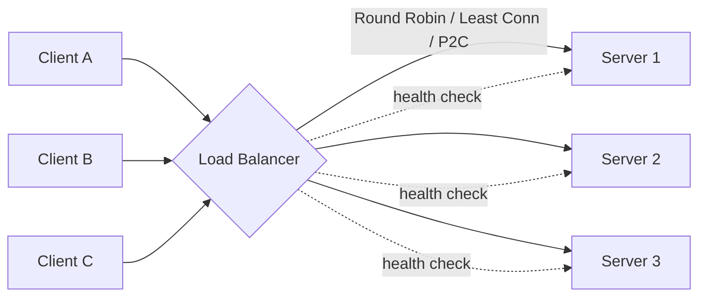
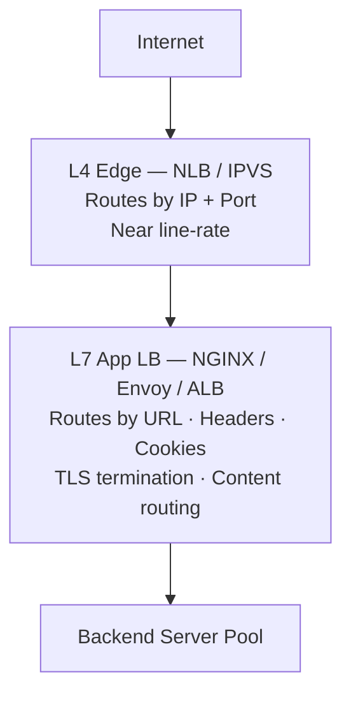
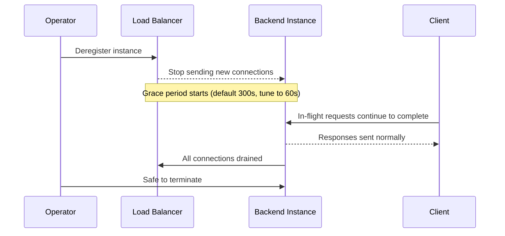
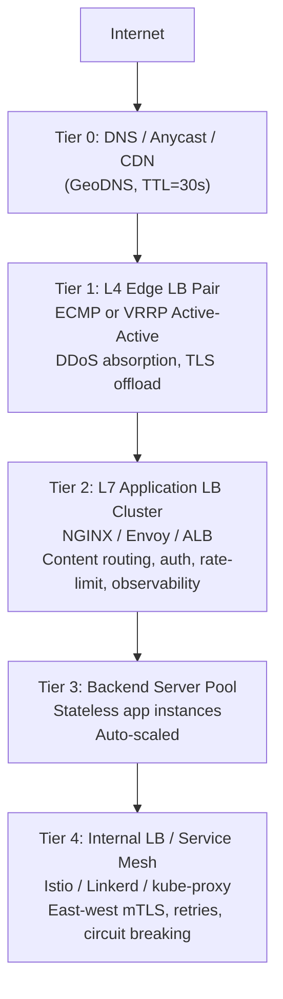

<!-- tldr -->
# Load Balancing

A load balancer sits between clients and a server pool, continuously routing requests to healthy backends using a chosen algorithm. It serves three jobs: **health** (never send to a broken node), **distribution** (spread load by algorithm), and **termination** (optionally handle TLS, compression, or protocol translation). Without it, every capacity, availability, and deployment problem converges on a single machine.



<!-- standard -->

## What It Is

A load balancer is a traffic dispatcher — hardware appliance, software process, or cloud-managed service — that accepts connections on a virtual IP or DNS name and forwards them to one of N backend instances. It maintains a view of backend health and applies a distribution algorithm on every new request or connection.

## Why It Matters

| Problem | Without LB | With LB |
|---|---|---|
| Capacity ceiling | Vertical scale only | Add commodity nodes horizontally |
| Single point of failure | One crash = total outage | Traffic reroutes to healthy nodes |
| Deployment risk | Big-bang, all-or-nothing | Rolling / canary per weight knob |
| Geographic latency | All users hit one region | Route to nearest data centre |
| Hot spots | All threads compete | Isolate pools per request type |

## Primary Techniques

### Static Algorithms (O(1), no server state)
- **Round Robin** — circular pointer across the pool; assumes homogeneous fleet.
- **Weighted Round Robin** — server with weight 3 gets 3× requests; use for mixed instance sizes.
- **Smooth Weighted RR** — interleaves high-weight servers to avoid request bursts.
- **Random** — surprisingly effective at scale; no shared pointer contention.

### Dynamic Algorithms (track real-time metrics)
- **Least Connections** — route to server with fewest active connections; ideal for long-lived WebSocket/gRPC streams.
- **Least Response Time** — route to fastest-responding server; requires RTT probing.
- **Power of Two Choices (P2C)** — pick two random servers, route to the less-loaded one; reduces max load from O(log N / log log N) to O(log log N) with O(1) overhead. Used by NGINX, Envoy, and Twitter Finagle.

### Session Affinity
| Mechanism | Pros | Cons |
|---|---|---|
| Cookie affinity | Survives NAT | Breaks HTTP-only APIs |
| IP hash | Protocol-agnostic | NAT collapses many users to one server |
| Consistent hashing | Minimal reshuffling on scale events | More complex |

**Prefer externalising session state (Redis, DynamoDB)** so any server can handle any request — then affinity becomes unnecessary.

## Layer 4 vs Layer 7



- **L4** sees only IP + TCP/UDP port; near line-rate; used for DDoS absorption and raw throughput.
- **L7** parses every request; enables URL routing, header injection, auth, gRPC method routing; higher CPU cost.
- Production pattern: L4 at the edge for throughput, L7 behind it for intelligence.

## Key Tradeoffs
- More dynamic the algorithm → more bookkeeping overhead on the LB.
- Sticky sessions → easier server-local state, harder failover and rolling deploys.
- Short DNS TTLs (30–60 s) → faster failover, higher resolver load.
- L7 inspection → richer routing, measurably higher per-connection CPU.

<!-- deep -->

## Algorithms: Formulas and Real-World Usage

### Power of Two Choices — Why It Works

With pure random assignment across N servers, the most-loaded server receives O(log N / log log N) requests. Picking the better of two random choices reduces that bound to O(log log N) — a dramatic improvement for large N with essentially zero overhead.

```python
import random

def p2c_pick(servers):
    a, b = random.sample(servers, 2)
    return a if a.active_conns <= b.active_conns else b
```

**Used by:** NGINX (`least_conn` with randomisation), Envoy (`LEAST_REQUEST` with `choice_count=2`), Twitter Finagle, AWS ALB internally.

### Weighted Round Robin — Smooth Variant

Nginx's `upstream` block supports `weight=N`. For mixed fleets (4-core + 16-core nodes), set weights proportional to capacity. Smooth WRR (Nginx OSS implementation) interleaves rather than batching: a 3:2:1 weight produces `A B A C A B` not `A A A B B C`, reducing latency variance.

---

## Health Checks: Parameters and Detection Lag

| Check Type | Latency | False-Positive Risk |
|---|---|---|
| TCP connect | ~1 ms | High — port open ≠ app healthy |
| HTTP GET /health | ~5 ms | Medium |
| Deep check (DB + cache ping) | ~50 ms | Low, but run at lower frequency |
| gRPC Health Protocol | ~5 ms | Low for gRPC services |

**Detection lag formula:**

```
detection_lag = check_interval × failure_threshold
```

Typical production setting: `5 s × 2 = 10 s` before traffic stops flowing to a failed node. Aim for `< 15 s` total detection lag in SLA-sensitive systems.

### Connection Draining Sequence



Set `deregistration_delay` to match your P99 request duration + buffer. For APIs with P99 < 500 ms, `60 s` is safe. For batch jobs, tune higher.

---

## DNS Load Balancing and Anycast

- **GeoDNS** — AWS Route 53, NS1, Cloudflare return different A records based on EDNS client subnet. EU resolvers get EU IPs; latency savings: 50–150 ms RTT for cross-continent requests.
- **Latency-based routing** — Route 53 measures RTT from resolver to each regional endpoint and picks the lowest. Effective when origin latency dominates.
- **Anycast** — same /24 prefix announced from dozens of PoPs via BGP. Client packets naturally route to the nearest PoP. Used by Cloudflare (330+ PoPs), Fastly, and all major CDNs. No DNS TTL lag on failover — BGP reconverges in seconds.
- **TTL trap** — setting TTL=300 on a failover-critical record means clients can be stuck hitting a dead IP for up to 5 minutes. Use TTL=30–60 for active-failover records; accept higher resolver query volume.

---

## Real-World Systems

| System | LB Technology | Algorithm / Pattern |
|---|---|---|
| AWS ALB | Managed L7 | Round Robin (HTTP), Least Outstanding Requests (gRPC) |
| AWS NLB | Managed L4 | Flow-hash (5-tuple); preserves client IP |
| Cloudflare | Anycast + L7 | GeoDNS + Argo Smart Routing (latency-based) |
| Facebook / Meta | Katran (eBPF/XDP) | P2C; kernel-bypass; 10M PPS on commodity NIC |
| Netflix | Eureka + Ribbon / Envoy | P2C with latency weighting (Hystrix circuit breaker) |
| Google (GFE) | Maglev | Consistent hashing; 1M+ RPS per frontend server |
| HAProxy | OSS software | `leastconn` for WebSocket/DB proxies; `roundrobin` for HTTP |
| Kubernetes | kube-proxy (IPVS mode) | Round Robin across ClusterIP endpoints (L4) |

### Capacity Numbers to Internalize
- Software LB (NGINX/HAProxy on 16-core): **~100 Gbps**, **~1M HTTP RPS**
- AWS ALB: auto-scales to handle **millions of RPS**; SLA 99.99%
- AWS NLB: **millions of connections/second**; **< 100 µs added latency**
- F5 BIG-IP i15000: **320 Gbps**, hardware-accelerated
- Facebook Katran (eBPF): **~10M PPS** per server, sub-microsecond overhead
- Health check detection lag target: **< 15 s**
- Connection draining grace period: **60–300 s** (match to P99 request duration)

---

## Multi-Tier Architecture



### HA Patterns

| Pattern | Failover Time | Notes |
|---|---|---|
| Active-Passive VRRP | 1–3 s | Half capacity wasted on standby |
| Active-Active ECMP | < 1 s (BGP reconvergence) | Full capacity utilised; BGP complexity |
| Cloud-managed (ALB) | Transparent | No operator burden; less control |
| DNS failover | 30–300 s (TTL-bound) | Coarse-grained; use only as last resort |

**keepalived + VRRP recipe:** each LB node broadcasts VRRP hellos every 1 s. Backup promotes itself and takes the virtual IP after 3 missed hellos → **< 3 s failover** with no cloud dependency.

---

## Failure Modes and Pitfalls

1. **LB as SPOF** — if you have one LB, you've just moved the SPOF. Always deploy in active-active or active-passive pairs.
2. **Health check too shallow** — TCP connect passing while the app deadlocks on a DB connection. Use deep health checks at lower frequency (every 30 s) alongside fast shallow checks (every 5 s).
3. **Thundering herd on failover** — when one node fails, remaining nodes absorb its traffic instantly. If they were at 70% utilisation, they're now at 100%+. Design for N+2 headroom, not N+1.
4. **DNS TTL ignored** — many mobile clients and JVMs cache DNS responses longer than the TTL. Don't rely solely on DNS for fast failover; combine with LB-level health routing.
5. **Sticky sessions blocking deploys** — cookie affinity pins users to old-version instances during a rolling deploy. Either drain the old instance fully before removing, or externalise session state and eliminate affinity.
6. **Long-lived connection skew with Round Robin** — a gRPC/WebSocket connection that lasts hours starves the algorithm. Switch to `leastconn` (HAProxy) or `LEAST_REQUEST` (Envoy) for long-lived protocols.
7. **Forgot connection draining** — terminating instances without draining causes mid-request TCP RST / 502s. Always set `deregistration_delay` ≥ P99 request duration.

---

## Interview Pitfalls

- **"Just use Round Robin"** — interviewers want to see you reason about request duration distribution. Long-tail workloads need least-connections or P2C.
- **Not mentioning health checks** — distribution without health awareness is useless. Always describe the feedback loop.
- **Ignoring the LB's own HA** — describe VRRP/ECMP or cloud-managed HA before the interviewer asks.
- **Sticky sessions as a first-class solution** — frame them as a smell; propose externalising state (Redis) instead.
- **Confusing L4 and L7** — be precise: L4 routes by IP/port opaquely; L7 parses HTTP and can route by path, header, method.

---

## Decision Rubric: When to Reach for What

| Question | Answer → Choice |
|---|---|
| Need HTTP/URL/header routing? | Yes → L7 (NGINX / Envoy / ALB). No → L4 (HAProxy TCP / NLB) |
| Throughput > 100 Gbps? | Hardware appliance or ECMP cluster. Otherwise software / cloud |
| Multi-region users? | GeoDNS + GSLB + anycast |
| Stateful sessions required? | Externalise state first. If impossible → cookie affinity |
| Kubernetes environment? | Ingress controller + optional service mesh (Istio / Linkerd) |
| Minimal operational burden? | Cloud-managed LB (ALB, GCP LB) |
| Long-lived connections (WS / gRPC)? | HAProxy `leastconn` or Envoy `LEAST_REQUEST` |
| Need circuit breaking / retries? | Envoy cluster outlier detection or service mesh |
| Zero-downtime deploys critical? | Connection draining + readiness probes mandatory |