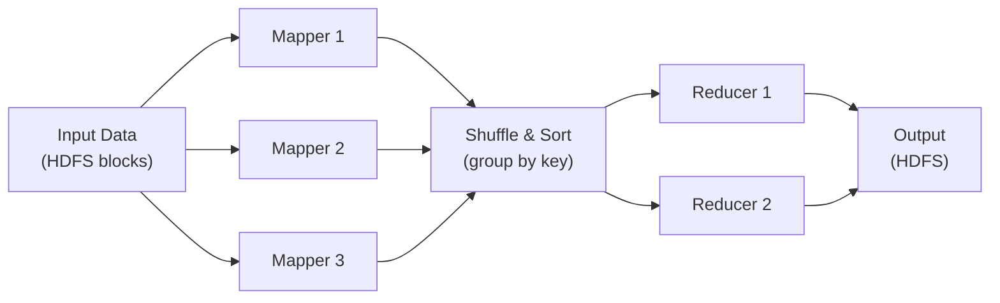
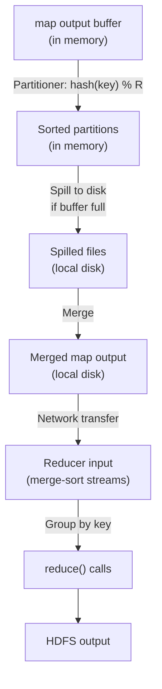
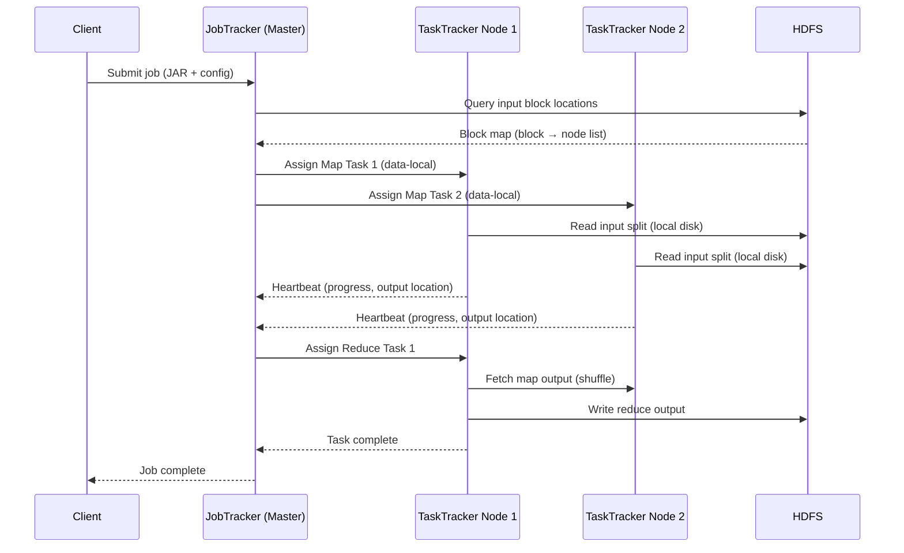
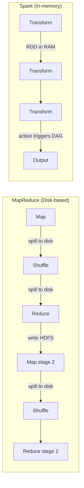

<!-- tldr -->
# MapReduce

MapReduce is a distributed batch-processing model where the framework splits input data across thousands of nodes, runs user-defined `map` and `reduce` functions in parallel, and handles fault tolerance transparently. It shifts paradigm from centralised computation on one powerful machine to distributed computation on many commodity machines. The developer writes no distributed code — partitioning, shuffling, retries, and data locality are all framework concerns. Google introduced it in 2004; Apache Hadoop is the open-source implementation.



<!-- standard -->

## What It Is

MapReduce is a **data-parallel programming model** built on two functions that operate on key-value pairs:

- **map(K1, V1) → List[(K2, V2)]**: Runs independently on each input partition. Emits zero or more intermediate key-value pairs.
- **reduce(K2, List[V2]) → List[(K3, V3)]**: Receives all values for one key after the framework groups them. Aggregates and emits final output.

Between the two phases, the **Shuffle & Sort** step collects all map outputs, partitions them by key (`hash(key) % num_reducers`), sorts within each partition, and ships each partition to the correct reducer over the network.

## Why It Matters

A single machine reading at 100 MB/s takes **115 days** to process 1 PB. The same job across 1,000 machines completes in **~2.8 hours**. MapReduce makes petabyte-scale processing routine by combining:

- **Data locality**: Schedule tasks on nodes that already hold the input replica. Move computation, not data.
- **Automatic partitioning**: Input splits default to one HDFS block (128–256 MB) per map task.
- **Transparent fault tolerance**: Failed tasks are re-executed on healthy nodes; developers write no retry logic.

## Primary Techniques

| Technique | Purpose | Cost |
|---|---|---|
| Combiner | Local pre-reduce on map node; reduces network I/O by up to 10× | Requires associative + commutative reduce fn |
| Speculative execution | Duplicate slow (straggler) tasks; kill loser | ~5–10% extra compute |
| Map-side join | Broadcast small table (<1 GB) into each mapper; zero reducers | Memory per mapper |
| Reduce-side join | Composite keys route both tables to same reducer | Extra shuffle cost |
| Secondary sort | Composite key (pk, sk) controls value order within reducer | Larger key size |

## Key Tradeoffs

- **Disk-based between stages**: Map output spills to local disk; reducers fetch from disk. Fault-tolerant but slow. Each stage boundary is a full materialisation.
- **Batch-only**: No native streaming. Minimum latency is 30 seconds due to startup overhead and disk I/O.
- **Simplicity vs. expressiveness**: Two-phase model fits many problems but forces multi-job chaining for iterative algorithms (ML, graph), causing 10–100× overhead vs. in-memory alternatives.



<!-- deep -->

## Deep Dive: MapReduce Internals

### Execution Architecture



**JobTracker** (single master):
- Maintains job queue; computes input splits from HDFS block metadata.
- Schedules tasks respecting data locality: prefers same node → same rack → any node.
- Detects dead TaskTrackers via missed heartbeats (10-minute timeout after 3-second intervals).

**TaskTracker** (one per slave node):
- Exposes fixed slots: typically 2 map + 2 reduce slots per node. Prevents overload but caps parallelism.
- Sends heartbeat every 3 seconds with task progress percentage and output file locations.

> ⚠️ **Single Point of Failure**: Classic Hadoop v1 JobTracker is a SPOF. YARN (Hadoop v2+) separates resource management (ResourceManager) from job scheduling (ApplicationMaster per job), adding HA via ZooKeeper-based active/standby failover.

---

### HDFS Storage Layer

| Component | Role | Failure Impact |
|---|---|---|
| NameNode | Namespace + block→node map; in-memory only | SPOF in v1; HA in v2 via standby NameNode |
| DataNode | Stores 128/256 MB blocks on local disk; heartbeats NameNode | Transparent; NameNode re-replicates lost blocks |
| Block replication factor | Default 3; placement: 1 local, 1 same-rack, 1 cross-rack | Survives 2 simultaneous node failures |

**Write pipeline** (pipelined replication):
1. Client streams to DataNode 1 → DN1 pipelines to DN2 → DN2 pipelines to DN3.
2. ACK chain returns: DN3 → DN2 → DN1 → Client.
3. P99 write latency for a 128 MB block on a healthy cluster: **~2–5 seconds** (limited by slowest replica).

---

### Fault Tolerance: Algorithms & Guarantees

**Task failure re-execution**:
- Map task failure: entire local output discarded; task reruns and re-reads HDFS split (always available from replicas). Idempotency required — map function must be deterministic.
- Reduce task failure: re-fetches map outputs (still on map nodes' local disk). If map node died, map task also reruns.
- Guarantee: **at-least-once** semantics. Make functions idempotent; write to HDFS (atomic rename) for exactly-once output.

**Speculative execution**:
- Triggered when a task's progress is significantly below the cluster median.
- Launches duplicate on a different node. First to finish wins; other is killed.
- Trade-off: wastes ~5–10% extra compute; reduces P99 job time by eliminating stragglers.
- Real numbers: On a 1,000-task job where 50 tasks straggle from 10 s → 30 s, speculative execution caps total time at ~25 s vs. 30 s.

---

### MapReduce Patterns: Concrete Algorithms

#### Word Count (Canonical)
```
map(line_num, text):
  for word in text.split():
    emit(word, 1)

reduce(word, [1,1,1,...]):
  emit(word, sum(counts))
```
**Combiner optimisation**: Use the same sum function as combiner. If a mapper emits 10,000 `(the, 1)` pairs, the combiner reduces this to one `(the, 10000)` before network transfer. Network bytes saved: **~10× reduction** in shuffle volume for high-frequency keys.

#### Inverted Index (Search Engine Core)
```
map(doc_id, text):
  for word in text.split():
    emit(word, doc_id)

reduce(word, [doc_id, ...]):
  emit(word, sorted(unique(doc_ids)))
```

#### Reduce-Side Join
```
map(key, record):
  if source == "orders":
    emit(user_id, ("O", order_data))
  elif source == "users":
    emit(user_id, ("U", user_data))

reduce(user_id, values):
  users = [v for v in values if v[0]=="U"]
  orders = [v for v in values if v[0]=="O"]
  for u in users:
    for o in orders:
      emit(user_id, join(u, o))
```
Secondary sort on record type ensures user records arrive before order records in the reducer.

---

### Real-World Systems Using MapReduce

| System | MapReduce Usage |
|---|---|
| **Google (original)** | Web crawl processing, inverted index construction, PageRank |
| **Facebook (2008–2014)** | Ad analytics, user activity aggregation on multi-PB Hive warehouse |
| **Yahoo** | Early YARN development; 40,000-node Hadoop cluster (2012) |
| **LinkedIn** | Log aggregation, data pipeline ETL before migrating to Spark/Kafka |
| **AWS EMR** | Managed Hadoop/MapReduce; still offered, now mostly Spark |

---

### Capacity & Latency Numbers

| Metric | Typical Value |
|---|---|
| HDFS block size | 128 MB (default), 256 MB (large files) |
| Replication factor | 3 (default) |
| TaskTracker heartbeat interval | 3 seconds |
| Dead node detection timeout | 10 minutes |
| Map task startup overhead | 15–30 seconds (JVM launch) |
| Minimum job latency | 30–60 seconds |
| Combiner network savings | 5–10× for skewed data |
| Speculative execution trigger | Task progress < median after 60 s |
| HDFS write throughput (single client) | 100–200 MB/s |
| Cluster throughput (1,000 nodes) | 50–100 GB/min |

---

### MapReduce vs. Modern Alternatives



| Aspect | MapReduce | Spark | Flink |
|---|---|---|---|
| Execution model | Batch, disk-based | Batch + micro-batch, in-memory RDDs | Stream-native, event-time |
| Minimum latency | 30 s–minutes | Seconds (cached RDDs) | Milliseconds |
| Iterative algorithms | Poor (disk between stages) | Excellent (10–100× faster) | Excellent |
| Fault tolerance | Task re-execution | RDD lineage replay | Distributed snapshots (Chandy-Lamport) |
| Exactly-once | No (at-least-once + idempotency) | No native (write-once output) | Yes (distributed checkpoints) |
| Ease of use | Low (write map/reduce in Java) | High (Python, SQL, DataFrames) | Moderate |
| Streaming | None | Micro-batch (Structured Streaming) | True streaming |

**Why Spark won**: In-memory RDDs eliminate disk I/O between stages. ML training that iterates over a 100 GB dataset 50 times takes **~50 minutes on Spark** vs. **~3 hours on MapReduce** (50 HDFS read/write cycles). Unified API (SQL + ML + Graph + Streaming) removes tool-switching friction.

**Why Flink goes further**: Distributed snapshots (Chandy-Lamport algorithm) deliver **exactly-once** semantics with <100 ms checkpoint overhead. Event-time watermarks handle late-arriving events correctly — critical for billing systems, fraud detection, SLA monitoring.

---

### Failure Modes & Interview Pitfalls

**Common failure modes**:
- **Non-idempotent map functions**: If a map task writes to an external DB and retries, you get duplicate writes. Always write to intermediate HDFS; use atomic rename for output.
- **Data skew**: One key (e.g., `null`, or a viral hashtag) concentrates all values in one reducer → 1 reducer runs for 10× longer than others. Fix: salted keys + two-pass reduce, or custom partitioner.
- **NameNode SPOF**: Classic v1 NameNode failure kills the entire cluster. Fix: YARN HA with standby NameNode and shared edit log (JournalNodes).
- **Shuffle OOM**: Reducers buffer all map outputs during merge. Very high-cardinality data can exhaust heap. Fix: increase reducer heap, add more reducers, or use a combiner.
- **Slot misconfiguration**: Too many reduce slots starve map slots (and vice versa). Tune based on job profile.

**Interview pitfalls**:
- Confusing the **combiner** (optional local reduce, must be associative+commutative) with the **partitioner** (routes keys to reducers — always runs).
- Stating MapReduce provides **exactly-once** — it doesn't without idempotent functions + atomic output commits.
- Forgetting that **NameNode holds all metadata in RAM** — namespace size is bounded by NameNode heap (~100 million files per NameNode with default settings).
- Proposing MapReduce for **low-latency** use cases (real-time dashboards, online serving). Minimum latency is 30+ seconds.

---

### When to Reach for MapReduce

**Use MapReduce when**:
- ✅ Batch ETL on an existing Hadoop cluster with no budget for migration.
- ✅ Jobs are simple, single-pass transformations (not iterative ML).
- ✅ Regulatory/compliance requirements mandate on-prem Hadoop with audited lineage.
- ✅ Team has deep Hive/Pig expertise and the job runs infrequently (nightly reports).

**Reach for Spark instead when**:
- Iterative algorithms (ML training, graph algorithms).
- Need unified batch + streaming.
- Latency requirement < 30 seconds.
- New greenfield project with no legacy Hadoop dependency.

**Reach for Flink instead when**:
- True sub-second streaming with event-time correctness.
- Exactly-once processing is a hard requirement (billing, fraud).
- Complex windowed aggregations over out-of-order streams.