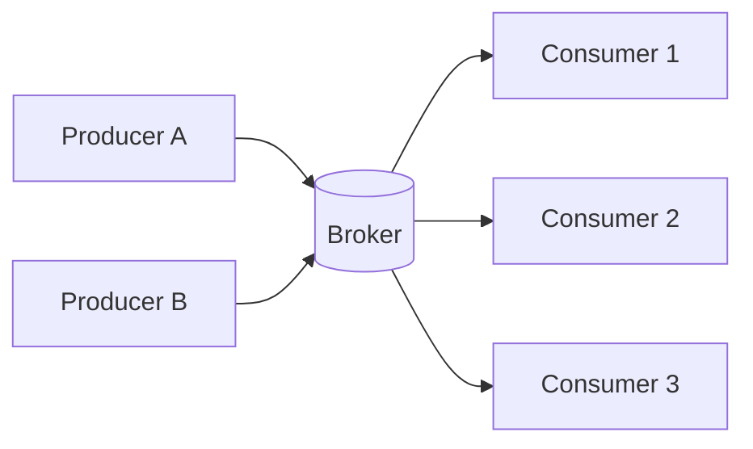
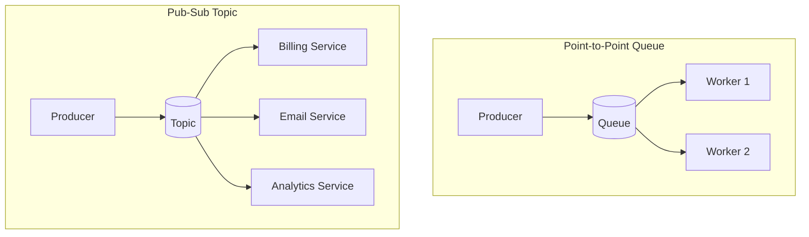
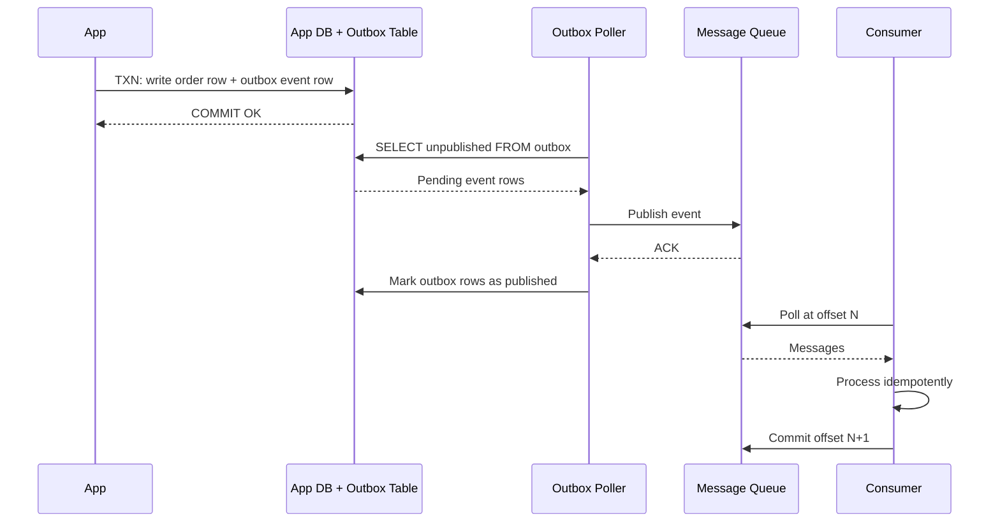

<!-- tldr -->
# Message Queues and Pub-Sub

A message queue is a durable broker-mediated buffer between producers (services emitting events) and consumers (services processing them). Producers write without waiting; consumers read at their own pace. This single decoupling primitive eliminates synchronous coupling, absorbs traffic bursts, and allows each tier to scale independently. Log-based systems like Kafka extend this with infinite replay and simultaneous fan-out to many independent consumer groups.



<!-- standard -->

## What It Is

A broker manages a set of named **topics or queues**. Producers append messages; consumers read by tracking their **offset** (position in the log). The broker handles durability, replication, and routing.

**Key primitives:**

- **Topic / Queue** — logical channel; messages are appended to it
- **Partition** — shard of a topic; the unit of parallelism and intra-partition ordering
- **Offset** — consumer's read cursor; enables replay and exactly-once semantics
- **Consumer Group** — set of consumers that collectively divide partitions among themselves
- **Broker** — stateful server holding queue data, managing replication and leader election

## Point-to-Point vs Pub-Sub

| Dimension | Point-to-Point | Pub-Sub |
|-----------|----------------|---------|
| Delivery | One consumer per message | All subscribers receive every message |
| Use Case | Task queues, competing workers | Event fan-out, notifications |
| Retention | Deleted after consumption | Retained for replay / late subscribers |
| Example | Order worker pool | Payment event → Billing + Email + Analytics |



## Primary Techniques

- **Log-based (Kafka, Pulsar):** append-only, offset-tracked log; supports replay and multiple independent consumer groups; ideal for high-throughput event streaming and audit trails
- **Traditional broker (RabbitMQ):** exchange/queue model with AMQP routing, acknowledgments, and dead-letter queues; ideal for flexible routing and lower-volume task distribution
- **Managed cloud (SQS/SNS):** zero ops overhead; SQS for durable point-to-point queues, SNS for instant push fan-out; combined for durable pub-sub without running your own cluster

## Key Tradeoffs

| Concern | Kafka | RabbitMQ | SQS (Standard / FIFO) |
|---------|-------|----------|-----------------------|
| Throughput | ~1M msg/s per cluster | ~50–100K msg/s | Unlimited / ~300 msg/s |
| Ordering | Strict per-partition | Best-effort | Best-effort / Strict |
| Delivery | At-least-once; exactly-once via transactions | At-least-once | At-least-once / Exactly-once |
| Replay | Yes (log retention, default 7 days) | No | No (14-day max retention) |
| Ops Overhead | High (brokers, KRaft/ZooKeeper) | Medium | None (fully managed) |

**Push vs Pull:**

- **Pull (Kafka, SQS long-poll):** consumer controls pace; natural backpressure; ~1–5ms added latency
- **Push (RabbitMQ, SNS):** broker initiates delivery; lower latency; risks overwhelming a slow consumer

<!-- deep -->

## Deep Dive

### Kafka Architecture

A Kafka topic is split into **N partitions**, each an ordered append-only log replicated across brokers. The **replication factor (RF)** determines redundancy: RF=3 tolerates 1 broker failure. One replica is the **leader** (serves all reads and writes); others are **in-sync replicas (ISR)**.

**Producer write path:**
1. Producer hashes partition key → selects target partition
2. Batch accumulated and sent to partition leader
3. Leader appends to local log, replicates to ISR
4. ACK returned based on `acks` setting: `0` = fire-and-forget, `1` = leader only, `all` = full ISR

**Consumer read path:**
1. Consumer polls leader for messages at offset N
2. Broker returns all messages from N onward (up to `max.bytes`)
3. Consumer processes messages, then commits offset N+K

**Throughput estimation:**
```
Max cluster throughput ≈ partition_count × per_partition_write_rate
```
A single partition sustains ~100 MB/s on modern hardware. 10 partitions → ~1 GB/s aggregate write throughput.

**Observed capacity numbers:**
- Write latency: P99 < 10 ms (same-AZ, RF=3, `acks=all`)
- Read latency: P99 < 5 ms (consumer polling leader directly)
- Default message size limit: 1 MB (configurable)
- Default log retention: 7 days (time-based) or configurable by bytes

### Delivery Guarantees In Practice

| Guarantee | Mechanism | Failure Scenario |
|-----------|-----------|-----------------|
| At-most-once | Commit offset before processing | Crash after commit → message silently lost |
| At-least-once | Process then commit offset | Crash after process, before commit → redelivered |
| Exactly-once | Atomic produce + offset commit via Kafka transactions | Requires idempotent producer + transactional API end-to-end |

**Production-grade approach — at-least-once + idempotency:**
```
1. Consume message at offset N
2. Process with idempotent operation (deduplicate by message_id in Redis/DB with TTL)
3. Commit offset N+1
```
Crash between steps 2 and 3 causes a replay; idempotency makes the re-execution a no-op. This is simpler and faster than distributed exactly-once transactions.

**Deduplication window sizing:** TTL on seen message IDs should exceed the maximum expected consumer lag, typically 5–30 minutes for most pipelines.

### Ordering and Partition Key Strategy

Global ordering requires a single partition — a throughput bottleneck capped at ~10 MB/s. Use **per-partition ordering** instead: all messages for the same logical entity land on the same partition and are consumed in sequence.

| Scenario | Partition Key | Effect |
|----------|--------------|--------|
| Order lifecycle events | `order_id` | All events for one order are sequenced |
| Multi-tenant platform | `tenant_id` | Per-tenant isolation and ordering |
| User activity stream | `user_id` | Causal ordering per user |
| Analytics fire-and-forget | None (round-robin) | Maximum throughput, no ordering |

**Partition count sizing:** over-provision upfront — Kafka cannot reduce partition count after creation. A safe starting point: `max_expected_consumers × 2`, reviewed at 80% utilization.

### RabbitMQ Exchange Types

RabbitMQ routes messages through **exchanges** bound to queues via routing keys:

- **Direct:** exact key match → single queue; use for task routing
- **Topic:** wildcard pattern (`order.#` matches `order.created`, `order.shipped`); use for categorical fan-out
- **Fanout:** broadcast to all bound queues regardless of key; classic pub-sub
- **Headers:** route by message attribute map; rarely needed

**Dead-Letter Queue (DLQ):** after N failed ACKs, RabbitMQ automatically routes the message to a DLQ. This prevents a single poison-pill message from blocking the entire queue indefinitely. Alert on any DLQ depth growth — it signals systematic consumer failure.

### AWS SQS and SNS

**Visibility Timeout:** when a consumer reads an SQS message, it becomes invisible for T seconds. If not deleted within T, it reappears. Rule of thumb: set T = 6× your P99 processing time.

**Durable fan-out pattern (SNS + SQS):**
```
SNS Topic ──► SQS Queue A  (Billing — independent consumption rate)
           ──► SQS Queue B  (Email   — independent retry policy)
           ──► SQS Queue C  (Shipping — independent DLQ)
```
SNS provides instant push delivery; each SQS queue provides per-subscriber durability, retry, and backlog isolation.

**FIFO queue limitations:** 300 msg/s raw (3,000 with batching), exactly-once within a 5-minute deduplication window. Reach for FIFO only when strict ordering plus exactly-once outweighs the throughput cap — typically financial ledger writes or sequenced command processing.

### The Outbox Pattern

Solves the **dual-write problem**: writing to an app database and a message queue are two separate I/O operations. A crash between them loses the event silently.



The event lives in the local DB transaction. If the queue is unavailable, the poller retries. Once published, the consumer's idempotency guard prevents double-processing on replay.

### Failure Modes

| Failure | Symptom | Mitigation |
|---------|---------|-----------|
| Consumer lag spike | Queue depth grows; SLA breach | Auto-scale consumer replicas; alert at > 30s lag |
| Poison-pill message | Consumer crashes in tight loop | DLQ after N retries; exponential backoff |
| Partition leader failure | Produce errors until new leader elected | RF=3; `min.insync.replicas=2`; election completes in ~15–30s |
| Hot partition | One partition receives all load | Review partition key for cardinality; avoid low-cardinality keys on high-volume topics |
| Consumer group rebalance storm | All consumers pause processing simultaneously | Enable incremental cooperative rebalance (Kafka 2.4+) |
| Clock skew in event ordering | Wall-clock timestamps unreliable for sequencing | Rely on Kafka partition offsets for ordering, not message timestamps |

### Consumer Health Monitoring

Critical metrics to instrument:

- **Consumer lag** (messages behind latest offset): alert threshold typically 10K messages or 30s of data
- **Processing latency P99**: per message; alert if approaching SLA
- **DLQ depth**: any nonzero growth warrants immediate investigation
- **Redelivery / retry rate**: sustained elevation signals idempotency bugs or downstream failures
- **Batch fill rate**: consistently undersized batches waste poll cycles; oversized batches indicate lag risk

### Interview Pitfalls

1. **"Kafka guarantees exactly-once"** — only with idempotent producer + transactional API + compatible consumer logic. Most production systems use at-least-once + application-level idempotency.
2. **"More partitions always means more throughput"** — partitions increase file handles, memory on brokers, and leader election time. Over-partitioning harms stability.
3. **"SQS is just a reliable queue"** — Standard SQS is at-least-once with best-effort ordering. Assuming strict ordering in Standard queues will surface as race conditions under load.
4. **Dual-write without the outbox pattern** — writing to both DB and queue in separate operations is a common candidate mistake; one half will be lost on crash.
5. **Setting visibility timeout too short** — redeliveries start before the consumer finishes, causing duplication spikes under slow processing.
6. **Ignoring consumer lag as a scaling signal** — candidates often scale on CPU or memory; consumer lag is the correct autoscaling metric for queue-driven workloads.

### Decision Rubric: When to Reach for a Message Queue

**Use a message queue when:**
- Processing can be deferred (user does not wait for the result)
- Multiple downstream services need the same event (fan-out)
- Traffic is spiky and consumers cannot match peak producer rate
- Consumer downtime tolerance is required (durable buffer during outages)
- Audit trail, event replay, or time-travel debugging is needed

**Use a direct synchronous call when:**
- Caller needs an immediate response (user login, price check, auth)
- Latency target is P99 < 50 ms and queue overhead is prohibitive
- Strictly one-to-one service relationship with no fan-out
- Strong consistency is required and eventual delivery semantics do not fit

| Scenario | Recommendation | Rationale |
|----------|---------------|-----------|
| Order created → email + billing + shipping | MQ Pub-Sub (Kafka/SNS+SQS) | Fan-out; services have different processing speeds |
| User authentication | Direct HTTPS/gRPC | Synchronous; user is actively waiting |
| Analytics ingest (100 GB/day) | Kafka + consumer groups | High throughput; replay; multiple readers |
| Payment processing | MQ + idempotent consumers | Cannot lose or duplicate; async acceptable |
| Real-time price feed to UI | Direct gRPC streaming | Sub-10ms latency; no queue overhead justified |
| Cross-service distributed transaction | Saga via MQ (choreography) | Avoids 2PC; resilient to partial failure |