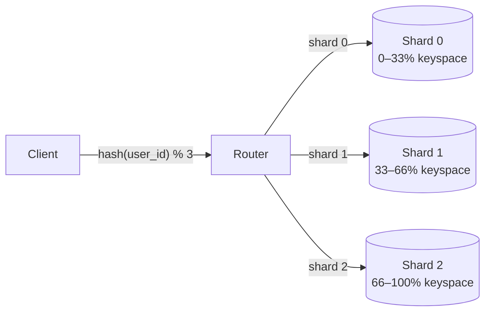
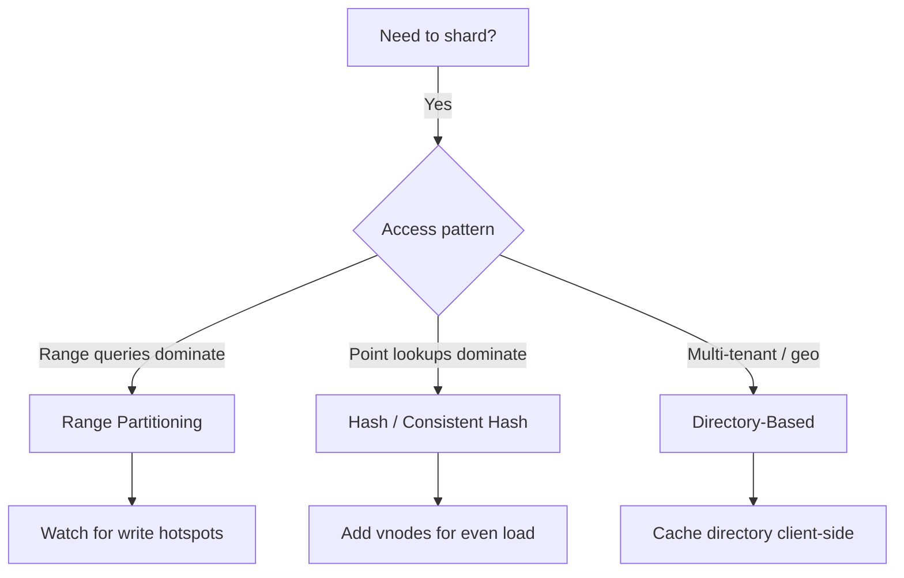
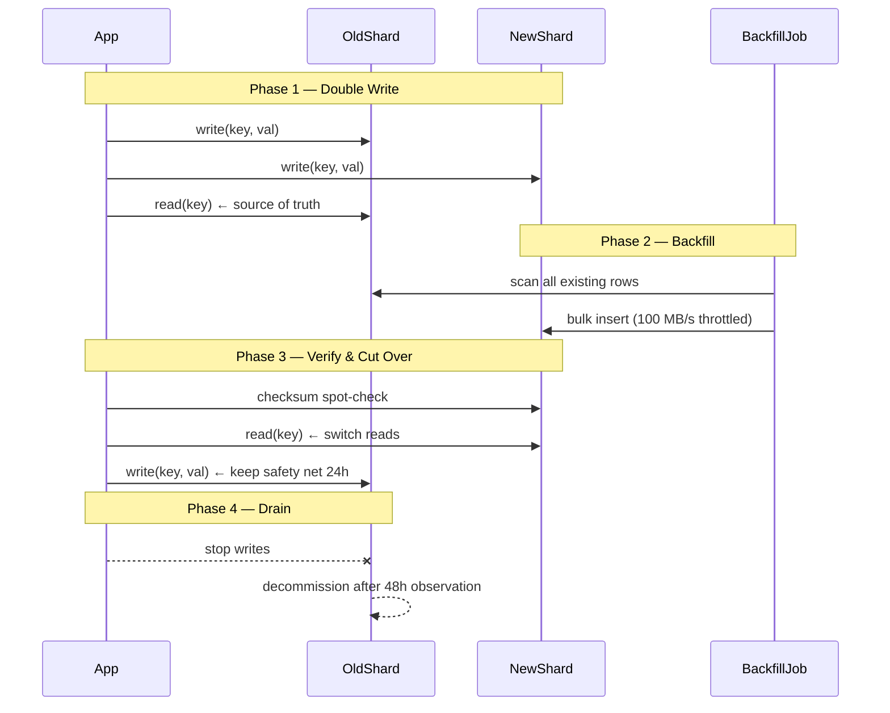
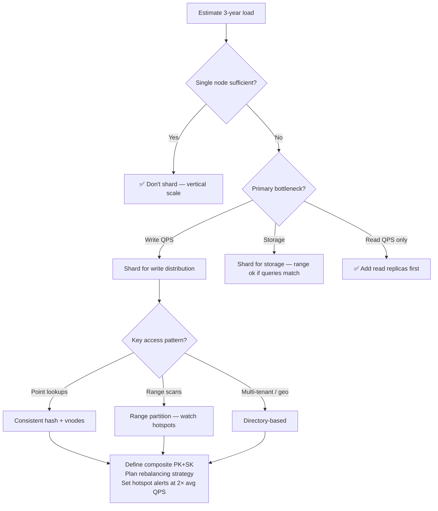

<!-- tldr -->
# Partitioning and Sharding

A single PostgreSQL node caps at ~50K write TPS, ~10–20 TB storage, and ~1K concurrent connections. Partitioning splits the dataset across N machines so each handles 1/N of the load. It trades operational simplicity for horizontal scalability, and always comes paired with replication in production.



<!-- standard -->

## What It Is

Partitioning (a.k.a. sharding) assigns each row to exactly one node based on a **partition key**. Every read/write first routes through a coordinator (or smart client) that maps the key to the correct shard. Replication then copies each shard to 2–3 replicas for fault tolerance — the two techniques are complementary, not alternatives.

## Why It Matters

| Scale | Storage | Write QPS | Connections |
|---|---|---|---|
| 1 node | 10–20 TB | 50K | 1K |
| 10 shards | 100–200 TB | ~500K | 10K |
| 100 shards | 1–2 PB | ~5M | 100K |

**Vertical scaling first.** A larger instance is always simpler. Partition only when you've exhausted vertical options or when a single point of failure is unacceptable.

## Primary Techniques

- **Range partitioning** — contiguous key ranges per shard (A–M / N–Z). Efficient range scans; prone to write hotspots on monotonically increasing keys (timestamps, auto-increment IDs).
- **Hash partitioning** — `hash(key) % N`. Near-perfect write distribution; range queries require scatter-gather across all shards. Naive modulo breaks on resize (~90% of keys remap).
- **Consistent hashing** — keys and nodes both hashed onto a 0→2³²−1 ring; a key belongs to the first node clockwise. Adding one node moves only ~1/N of keys. Virtual nodes (vnodes) fix uneven ring coverage.
- **Directory-based** — explicit lookup table maps keys to shards. Maximum flexibility (geo-routing, dedicated tenant shards); adds 1–5 ms extra hop per request.

## Key Tradeoffs

| Strategy | Range Queries | Write Distribution | Rebalancing Cost | Complexity |
|---|---|---|---|---|
| Range | ✅ Efficient | ❌ Hotspot risk | Medium | Low |
| Hash (modulo) | ❌ Scatter-gather | ✅ Uniform | ❌ ~90% data moves | Low |
| Consistent hash | ❌ Scatter-gather | ✅ Uniform | ✅ ~1/N data moves | Medium |
| Directory | Depends | Flexible | Low | High |



<!-- deep -->

## Algorithms and Formulas

### Consistent Hashing — Core Math

Each node and key is mapped via `MurmurHash3(id) mod 2^32`. A key `k` is owned by `min(node_pos > hash(k))`, wrapping around. With **V virtual nodes per physical node**:

```
Expected keys per physical node = total_keys / P
Std deviation ≈ sqrt(total_keys / (P × V))   (lower V → higher variance)
```

Cassandra default: **256 vnodes/node** → variance <1% even with heterogeneous hardware.

When adding node D to a P-node cluster:
```
Fraction of data that moves = 1 / (P + 1)
```
For P=9 → 10%  moves. Compare to naive modulo: ~90% moves.

### Composite Partition + Sort Key

```
Partition key → shard routing     (hash distributed)
Sort key      → intra-shard order (range queryable)

DynamoDB example:
  PK = user_id  →  routes to shard
  SK = created_at  →  range scan within shard

Query "all orders for user 12345 in Jan 2024":
  1. Hash(12345) → single shard   [O(1) network hop]
  2. Range scan SK ∈ [2024-01-01, 2024-01-31]  [O(log n) local]
```

Without composite key, `order_id` as PK forces scatter-gather across all shards for any per-user query — **100× slower** at 100 shards.

---

## Real-World Systems

### Apache Cassandra
- Consistent hashing with 256 vnodes/node.
- Replication factor typically 3 (RF=3); quorum reads/writes (`QUORUM` = RF/2 + 1 = 2).
- No single coordinator — any node can route via gossip-based topology map.
- P99 write latency: **<5 ms** at millions of writes/sec.

### Amazon DynamoDB
- Consistent hashing internally (Dynamo paper, 2007). Composite PK+SK model exposed publicly.
- Adaptive capacity: automatically redistributes capacity units to hot partitions.
- Partition limit: 3,000 RCU or 1,000 WCU per physical partition — exceeding triggers a split.

### Apache Kafka
- Partitions are the unit of parallelism. Default: `hash(key) % num_partitions`.
- **Partition count is fixed at topic creation** — changing it reshuffles key-to-partition mapping, breaking ordering guarantees. Pre-shard aggressively (e.g., 100 partitions for a high-throughput topic).
- Consumer groups assign one partition per consumer → scale consumers = scale partitions.

### HBase / Bigtable
- Range partitioning with automatic region splits at configurable size (default 10 GB).
- Classic hotspot trap: `timestamp` as row-key prefix → all writes to latest region.
- Fix: reverse the key (`com.google.www` instead of `www.google.com`) or prepend `hash(key)[0:2]` salt bucket.

### Vitess (YouTube's MySQL sharding layer)
- Directory-based via **VSchema** — explicit key range → shard mapping.
- Enables live resharding: double-write old+new, backfill, verify checksums, cut over reads, drain old shard. Total downtime: 0.

---

## Failure Modes

| Failure | Symptom | Mitigation |
|---|---|---|
| Write hotspot | One shard at 100% CPU, others at 10% | Random suffix on key, dedicated shard for celebrities |
| Rebalancing storm | All nodes thrash during node add | Fixed partition count (pre-sharding); throttle migration bandwidth |
| Directory SPOF | All requests fail when directory is down | Replicate directory (Raft/Paxos), client-side TTL cache |
| Cross-shard fan-out | P99 = worst shard latency × merge overhead | Co-locate data by join key; denormalize; broadcast small tables |
| Skewed vnodes | One physical node owns 40% of ring | Increase vnode count; use consistent seed for placement |
| Monotonic key hotspot | Latest shard drowns | Hash the key or prepend a random bucket prefix |

### The Celebrity / Thundering Herd Problem

When `user_id = katy_perry` has 100M followers and posts a tweet:
- **Fanout-on-write**: Pre-write to each follower's inbox → single key absorbs 100M writes. Catastrophic.
- **Hybrid model** (Twitter's approach): Normal users get push fanout; accounts >1M followers are fetched pull-on-read. Follower's timeline merges local inbox + celebrity feed at query time.

---

## Capacity and Latency Reference Numbers

```
MurmurHash3 throughput:      ~500 MB/s (single core) — negligible routing overhead
Consistent hash lookup:      O(log V) with sorted vnode array → <1 µs
Directory lookup (cached):   ~50 µs local cache hit
Directory lookup (remote):   1–5 ms (Redis/etcd hop)
Shard migration bandwidth:   Throttle to 50–100 MB/s to avoid impact on live traffic
Zero-downtime migration:     Hours (100 GB shard) to days (10 TB shard)
Scatter-gather fan-out tax:  P99 latency = slowest shard + ~5–20 ms merge; scales with shard count
```

---

## Zero-Downtime Resharding Sequence



---

## Interview Pitfalls

1. **"I'll just use `user_id % N`"** — Interviewer will ask "what happens when you add a node?" You need consistent hashing or pre-sharding.
2. **Forgetting the partition key changes problem** — Migrating from `order_id` to `user_id` partitioning requires a full table rebuild while live. Design this right upfront.
3. **Ignoring cross-shard queries** — Any `WHERE` clause without the partition key is a scatter-gather. Always ask: "what does my fan-out look like for the top 3 query patterns?"
4. **Conflating replication and partitioning** — Replication = fault tolerance + read scale. Partitioning = write scale + storage scale. Production systems need both.
5. **Not addressing hotspots proactively** — In interviews, mention the celebrity problem and temporal skew unprompted. It signals operational maturity.
6. **Kafka partition count miscalculation** — Partitions are immutable at creation. Under-sharding Kafka means you can't scale consumers later without breaking key ordering.

---

## Decision Rubric — When to Reach for Sharding



**Reach for sharding when:**
- Storage exceeds 10 TB on a single node within your planning horizon.
- Write QPS exceeds 30K–50K sustained (leaving headroom).
- A single node is an unacceptable single point of failure for writes (replication alone doesn't help write throughput).
- Multi-tenancy requires data isolation or geo-residency compliance.

**Don't shard when:**
- You can read-scale with replicas.
- A larger RDS/Aurora instance covers your horizon.
- Your access patterns require frequent cross-shard joins — denormalization may not be viable.