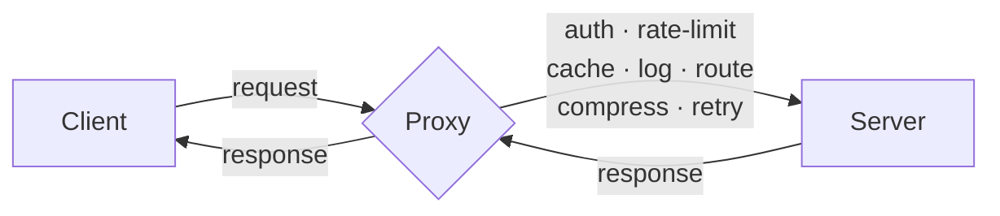
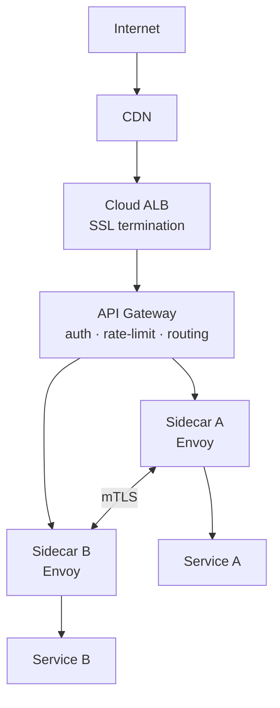
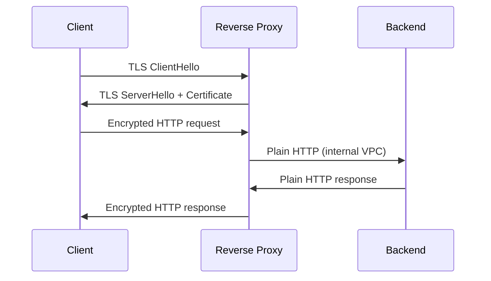
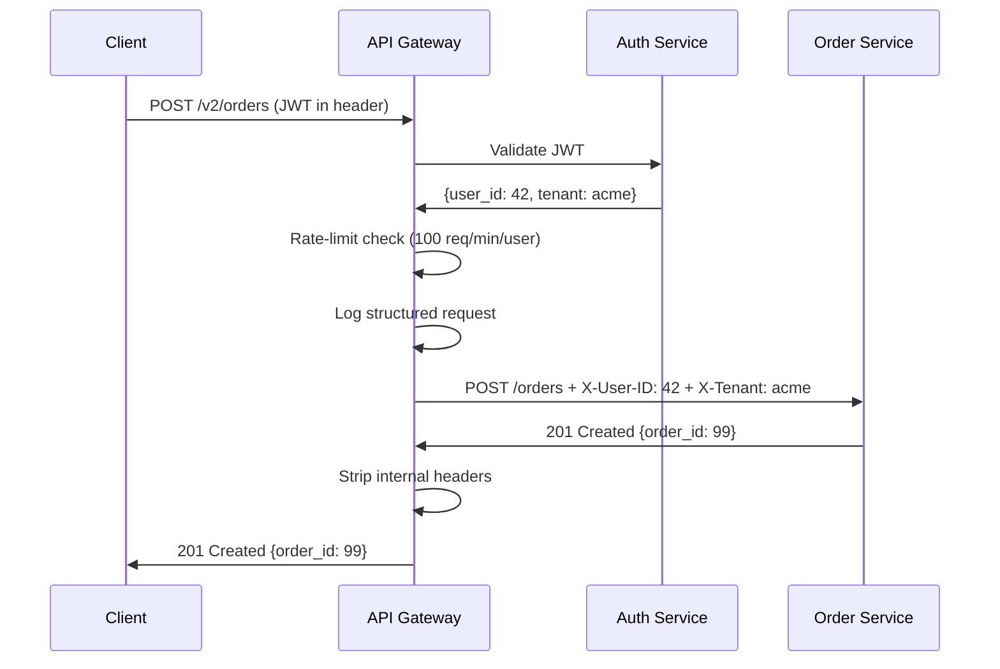

<!-- tldr -->
# Proxies

A proxy is a process that sits between two parties and forwards requests on their behalf. That extra hop is where every cross-cutting concern in distributed systems lives: security, observability, traffic control, and fault tolerance. Two directions exist—forward proxies (speak for clients) and reverse proxies (speak for servers). Modern architectures stack both simultaneously at different layers.



<!-- standard -->

## What It Is

A proxy implements the **single-responsibility principle at the infrastructure level**: application servers own business logic; the proxy owns everything else. Two fundamentally different orientations:

| Dimension | Forward Proxy | Reverse Proxy |
|---|---|---|
| Sits in front of | Clients | Servers |
| Hides | Client IP from servers | Server topology from clients |
| Configured by | Client / corporate policy | Server operator |
| Canonical tools | Squid, Zscaler, NAT Gateway | NGINX, HAProxy, Envoy, ALB |
| Primary use cases | Egress filtering, privacy, caching | Load balancing, TLS termination, routing |

## Why It Matters

Without a reverse proxy, every cross-cutting concern—rate limiting, certificate management, access logs—must be reimplemented in each service. With one, you get seven capabilities essentially for free:

- **Load balancing** — distribute across a backend pool (round-robin, least-connections, IP hash)
- **SSL/TLS termination** — decrypt once at the edge; backends receive plain HTTP, saving CPU
- **Request routing** — `/api/*` → API cluster, `/static/*` → S3/CDN based on URL or headers
- **Caching** — serve identical responses from memory; skip backend entirely
- **Compression** — gzip/brotli at the proxy reduces payload by 70–90%
- **Rate limiting** — 429 responses enforced centrally, not per-service
- **Observability** — structured access logs (latency, status code, upstream) in one place

## NGINX vs. HAProxy

| | NGINX | HAProxy |
|---|---|---|
| Best at | HTTP/S serving + static files + proxy | Pure L4/L7 load balancing |
| Dynamic config reload | Brief restart | Zero-downtime runtime API |
| Use when | Web server + proxy combo needed | Complex health checks, TCP proxying |

## Specialised Proxy Layers

**API Gateway** — a reverse proxy at the microservices edge that adds JWT validation, request transformation, versioning (`/v1/`, `/v2/`), and developer-portal integration. Kong, AWS API Gateway, Apigee.

**Service Mesh Sidecar** — a lightweight proxy (Envoy) co-deployed with every service instance. All pod-level traffic flows through it, giving you mTLS, retries, circuit breaking, and distributed tracing with zero application code changes. Istio, Linkerd.



<!-- deep -->

## Algorithms and Internals

### Load-Balancing Algorithms

| Algorithm | How It Works | Best For |
|---|---|---|
| Round-robin | Request N goes to backend N % pool_size | Homogeneous backends, stateless |
| Least connections | Route to backend with fewest active connections | Variable request durations |
| IP hash | `hash(client_ip) % pool_size` | Session stickiness without cookies |
| Weighted round-robin | Backend weight proportional to capacity | Mixed instance types |
| Random with two choices (P2C) | Pick 2 backends randomly, route to the less loaded | Better than pure random at scale |

### TLS Termination Deep Dive

TLS handshake (RSA 2048-bit) costs ~1–5 ms of CPU per new connection. At 10,000 TLS handshakes/sec that is meaningful load. Terminating at the proxy means:



**Re-encryption (end-to-end TLS):** For PCI-DSS or HIPAA, the proxy terminates external TLS and opens a new TLS connection to the backend. Internal traffic is encrypted; certificate management stays centralised. Service mesh mTLS does this automatically per-pod with auto-rotated certs (SPIFFE/SPIRE).

### Capacity Numbers

- NGINX / HAProxy: ~**1M concurrent connections** on a single 32-core node with event-driven I/O (epoll/kqueue)
- AWS ALB: auto-scales; tested to **1M RPS**; P99 added latency ~**1–2 ms**
- Envoy sidecar overhead: **~5 ms P99 added latency**, **~50 MB RAM** per pod at rest
- TLS termination throughput: ~**10 Gbps** per NGINX worker with AES-NI hardware acceleration

### NGINX Config Anatomy

```nginx
upstream api_backend {
  server 10.0.1.10:8080;
  server 10.0.1.11:8080;
  server 10.0.1.12:8080;
  keepalive 32;           # Reuse upstream connections; critical for latency
}

server {
  listen 443 ssl http2;
  ssl_certificate     /etc/ssl/api.crt;
  ssl_certificate_key /etc/ssl/api.key;
  ssl_session_cache   shared:SSL:50m;   # Session resumption; avoids full handshake

  location /api/ {
    proxy_pass         http://api_backend;
    proxy_set_header   X-Real-IP $remote_addr;
    proxy_read_timeout 30s;
  }

  location /static/ {
    root    /var/www/;
    expires 1y;
  }
}
```

`keepalive 32` is the highest-impact tuning knob—without it, NGINX opens a new TCP connection to the backend per request, adding ~1 ms RTT and exhausting ephemeral ports at scale.

## Real-World Systems

| System | How They Use Proxies |
|---|---|
| **Netflix** | Zuul (API gateway) at edge; Envoy sidecars between microservices for mTLS + circuit breaking |
| **Cloudflare** | Anycast reverse proxy at 300+ PoPs; each PoP runs custom NGINX + Lua for WAF, DDoS mitigation |
| **Google** | GFE (Google Front End) is a global reverse proxy handling all external traffic; terminates TLS, routes to internal services |
| **Uber** | Envoy-based service mesh (GUSO) handles 1M+ RPS internal calls with per-route circuit breakers |
| **AWS** | ALB (L7) and NLB (L4) are managed reverse proxies; API Gateway sits above ALB for REST/WebSocket/gRPC |

## Failure Modes

### Proxy as Single Point of Failure
Every request passes through the proxy. A crash takes down the entire service. Mitigation:

| HA Pattern | RTO | Mechanism |
|---|---|---|
| Active-Passive (Keepalived/VRRP) | 1–3 s | Backup claims virtual IP on failure |
| Active-Active (DNS round-robin) | ~TTL (30–300 s) | Both instances serve; DNS drops failed IP |
| Cloud ALB (AWS/GCP/Azure) | Seconds (managed) | Multi-AZ by default, 99.99% SLA |
| Anycast BGP | < 1 s | BGP withdraws failed PoP; traffic reroutes |

**Recommendation:** On cloud, use the managed LB. Rolling your own HA proxy is only justified for latency-critical edge cases or on-premise bare metal.

### Cascading Failure via Missing Circuit Breaking
Without circuit breaking at the proxy, a slow backend causes connection pool exhaustion. All requests queue; proxy RAM fills; proxy OOMs. **Fix:** configure upstream timeouts aggressively (`proxy_read_timeout 5s`) and enable circuit breaking (Envoy's `outlier_detection`).

### SSL Certificate Expiry
A lapsed cert at the proxy takes down HTTPS for every backend simultaneously. **Fix:** automate rotation with ACME/Let's Encrypt or ACM; alert at 30-day expiry.

### Thundering Herd on Proxy Restart
NGINX's graceful reload creates a brief window where new connections may be dropped. **Fix:** use HAProxy's runtime API for zero-downtime config updates, or pre-warm replacement instances before draining the old one.

## API Gateway Pipeline (Sequence)



## Interview Pitfalls

1. **"Just add a load balancer"** — interviewers want you to distinguish L4 (NLB, TCP) vs. L7 (ALB, HTTP-aware) proxies. L7 is required for header-based routing, JWT inspection, and path-based rules.
2. **Forgetting the proxy is on the critical path** — always address HA in your design; a single NGINX with no failover is a non-starter.
3. **Conflating API gateway and service mesh** — API gateway = north-south (client ↔ cluster boundary); service mesh = east-west (service ↔ service inside cluster). They complement, not replace, each other.
4. **Ignoring `keepalive` to backends** — without persistent upstream connections, proxy latency balloons under load. Always mention this when discussing NGINX/HAProxy tuning.
5. **Blanket service mesh recommendation** — valid only at 50+ services. Below that, the control-plane operational overhead outweighs the benefit.

## Decision Rubric: When to Reach for What

| Scenario | Right Tool |
|---|---|
| Web app: HTTPS + static files + routing | NGINX reverse proxy |
| Pure TCP/HTTP LB with complex health checks | HAProxy |
| Public API: edge auth, rate limiting, versioning | API Gateway (Kong, AWS API Gateway) |
| 50+ microservices: mTLS, retries, tracing | Service mesh (Istio, Linkerd + Envoy) |
| Global traffic routing to nearest datacenter | GeoDNS or Anycast CDN |
| Clients accessing internet through corporate policy | Forward proxy (Squid, Zscaler) |
| Cloud-native, zero ops overhead | Cloud ALB/NLB (AWS, GCP, Azure) |

**Layered production stack (outermost → innermost):**

```
Internet → CDN / GeoDNS → Cloud ALB → API Gateway → Sidecar Proxies → App Services
           DDoS, cache      SSL, HA     auth, routing   mTLS, retries    business logic
```

Each layer handles concerns appropriate to its position. No single proxy does everything; the right architecture stacks them intentionally.