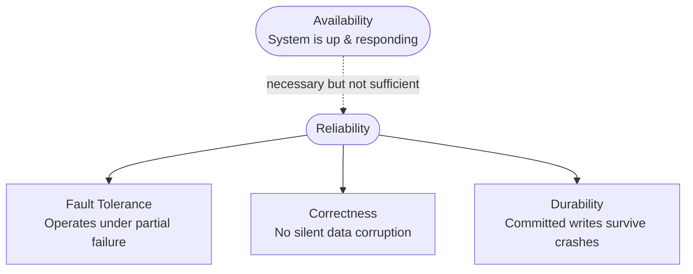
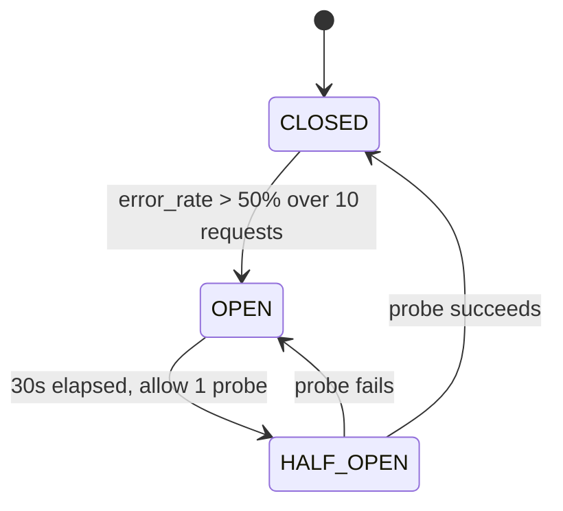
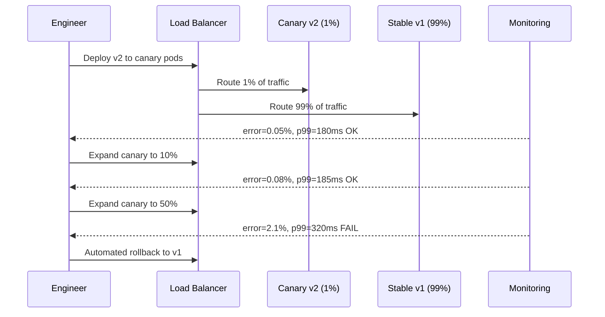

<!-- tldr -->
# Reliability

Reliability guarantees that a system performs its *correct* function at the *desired* level of performance even when hardware fails, software has bugs, or operators make mistakes. It is orthogonal to availability: a bank ATM that is up 99.9% of the time but occasionally double-dispenses cash is available—not reliable. Three pillars define it: **fault tolerance** (operate under partial failure), **correctness** (no silent data corruption), and **durability** (committed writes survive crashes).



<!-- standard -->

## What It Is

At 1 M QPS, a 0.001% silent error rate means 1,000 wrong answers per second. Reliability is the discipline of making that rate zero—or at least measurable, bounded, and accountable. The moment you separate "the system responded" from "the system responded *correctly*," you have separated availability from reliability.

## The Three Classes of Faults

Every outage traces to one root cause class, and each class demands a different mitigation:

| Fault Class | Typical Scope | Primary Mitigation |
|---|---|---|
| **Hardware** | Single node or rack | Redundancy: RAID, replicas, multi-AZ |
| **Software** | All nodes simultaneously | Staged rollouts, feature flags, testing |
| **Human** | Config, deployment, ops | IaC, automation, runbooks, one-click rollback |

Key numbers: hard drive AFR is **1–5%** (a 10,000-node cluster loses a drive daily); human error causes **40–80%** of production outages; software bugs are correlated—a single bad deploy can kill every replica at once.

## Primary Techniques

**Hardware faults** → redundancy at every layer: RAID-1 drops simultaneous failure probability to ~0.09%, N+1 or active-active compute, dual NICs, multi-AZ deployment (3 AZs preferred; ~33% more infra cost but the difference between a bad night and a major incident).

**Software faults** → canary deployments (1% → 10% → 50% → 100%, auto-rollback if error rate > 1% or p99 latency increases > 20%), feature flags for zero-deployment rollback, defensive coding (input validation, idempotency keys, fail-fast assertions, immutable append-only logs).

**Human faults** → Infrastructure as Code (Terraform/Pulumi), mandatory peer review for config changes, soft deletes over hard deletes, point-in-time recovery, audit logs on every state-changing action.

## Resilience Patterns

- **Timeouts**: `timeout = 2× p99 latency of dependency`. Non-negotiable. A single hanging dependency with no timeout can exhaust all threads and take down the caller.
- **Retries + exponential backoff + jitter**: `delay = min(cap, base × 2^attempt) + random(0, jitter_max)`. Jitter eliminates synchronized retry waves.
- **Circuit breaker**: Opens when error rate exceeds threshold; fails-fast on subsequent calls; probes recovery via HALF-OPEN state. Prevents retry storms from compounding overload.
- **Bulkheads**: Isolated thread pools per dependency. A slow Dependency B fills only its 50-thread pool; A, C, and core logic continue normally.
- **Graceful degradation**: Pre-defined tiered fallbacks—personalized recommendations fall back to "Popular Items"; real-time inventory becomes a boolean; reviews serve stale cache or are hidden entirely.



## Key Tradeoffs

- **More replicas** reduce hardware fault risk but amplify correlated software fault blast radius.
- **Aggressive retries** recover from transient errors but amplify load: 10% failure × 3 retries = 30% extra backend traffic at the worst moment.
- **Tight timeouts** prevent cascading hangs but cause spurious failures on legitimately slow healthy systems.

<!-- deep -->

## Deep Dive

### SLIs and SLOs — Quantifying Reliability

Reliability is not a feeling; it is a number. Three terms from the SRE framework:

- **SLI (Service Level Indicator)**: Raw user-observable metric. Good SLIs: request success rate, p99 read latency, write durability. Bad SLIs: CPU/memory utilization (internal—users never feel these directly).
- **SLO (Service Level Objective)**: Target bound on an SLI. E.g., "99.9% of requests complete successfully within 200 ms over a 30-day rolling window."
- **SLA (Service Level Agreement)**: Contractual SLO with financial penalties. SLOs must be stricter than SLAs to preserve error budget headroom.

**Error budget** = `1 − SLO`. At 99.9%, the monthly budget is **43.8 minutes**. Spend it deliberately (deployments, chaos experiments) rather than burning it on avoidable incidents.

### Canary Deployment — Containing Software Faults



Rollback triggers: error rate > 1%, p99 latency increase > 20%, any new panic/crash in logs. With pre-baked rollback automation, recovery completes in < 5 minutes. Feature flags add a second safety valve—flip a flag and revert in seconds without any deployment.

### Exponential Backoff with Full Jitter

```
delay = min(cap, base × 2^attempt) + random(0, base × 2^attempt)
```

Typical production values: `base = 100ms`, `cap = 30s`.

| Attempt | Base Delay | Jitter Range |
|---|---|---|
| 1 | 100 ms | 0–100 ms |
| 2 | 200 ms | 0–200 ms |
| 3 | 400 ms | 0–400 ms |
| 4 | 800 ms | 0–800 ms |
| 5 | 1,600 ms | 0–1,600 ms |
| 6+ | capped 30 s | 0–30 s |

Without jitter, every client that failed at T=0 retries at T=1s, then T=2s—synchronized waves that overwhelm a recovering service. Full jitter spreads retries uniformly across the window, flattening the spike.

### Bulkhead Sizing Formula

Isolate thread pools by dependency. Size each pool:

```
pool_size = (req/s × p99_ms / 1000) × safety_factor (1.5–2×)
```

**Example:** Dependency B handles 500 req/s at p99 = 100 ms → `(500 × 100) / 1000 × 2 = 100 threads`. If B degrades to p99 = 5,000 ms without isolation, the naïve pool needs 2,500 threads—consuming the entire JVM heap and starving every other dependency.

### Chaos Engineering — Production Validation

Netflix's Chaos Monkey (2011) established the discipline: randomly terminate EC2 instances *during business hours* so engineers fix issues immediately rather than discovering them at 3 AM. Their Simian Army expanded to kill entire AZs (Chaos Gorilla) and regions (Chaos Kong).

| Experiment | What It Validates | Recommended Blast Radius |
|---|---|---|
| Kill random pods | Auto-scaling, LB health checks, replica failover | Low — start here |
| Network latency +200 ms | Timeout configs, retry logic, cascading slowdowns | Low–medium |
| Packet loss 5–20% | TCP retry behavior, client-side timeout tuning | Low–medium |
| Kill DB primary | Failover time, application reconnect logic | High — staging first |
| Kill entire AZ | Multi-AZ routing, cross-AZ data replication | Critical — non-prod |
| Disk fill to 95% | Log rotation, disk pressure alerting | Low |
| CPU saturation | Autoscaler triggers, circuit breaker thresholds | Medium |

**Scientific method:** (1) Hypothesis with measurable SLO bounds. (2) Define blast radius. (3) Inject failure. (4) Observe metrics in real time. (5) Fix gaps before production finds them. The goal is **confidence**, not chaos.

### Real-World Systems

**Cassandra** — Tunable consistency (ONE / QUORUM / ALL). At `QUORUM` with RF=3, a write requires 2 acknowledgments. Hinted handoff handles short-lived node unavailability; read repair heals divergent replicas asynchronously.

**DynamoDB** — Multi-AZ synchronous replication by default. Conditional writes (optimistic locking via `ConditionExpression`) prevent lost-update anomalies. Strong consistent reads hit the leader replica; eventually consistent reads can hit any replica and are ~2× cheaper.

**Kafka** — `replication.factor=3`, `min.insync.replicas=2`, `acks=all`. A produce call only succeeds when 2 replicas have committed the record to disk. Losing 1 broker is transparent to producers and consumers; losing 2 triggers leader election (~seconds of unavailability).

**Zookeeper / etcd** — Coordination backbone for leader election. Majority quorum (3 or 5 nodes) must remain healthy. Single-node failure is tolerated; 2-of-3 loss causes write unavailability while reads may continue from the surviving node depending on client config.

### Failure Modes to Anticipate

1. **Correlated software failures** — All replicas run identical buggy code. Redundancy offers zero protection. Only staged rollouts and feature flags help.
2. **Retry storms** — 10% failure × 3 retries = 30% extra backend traffic *at the worst possible moment*. Always gate retries behind a circuit breaker.
3. **Cascading timeout misconfiguration** — Service A calls B calls C. If A's total timeout < B's downstream timeout, A aborts while B keeps a dangling connection to C open. Budget timeouts with the full call chain in mind: `total_timeout_A > timeout_B + timeout_C`.
4. **Silent data corruption** — DRAM bit flips (~1 correctable error per 4 GB/year), integer overflow at `2^31 − 1`, off-by-one errors active only for IDs divisible by 1,000. Detect with checksums, read-back verification, and runtime assertions that fail loudly.
5. **Backup rot** — Backups are taken but never tested. Schedule monthly restore drills for all critical data stores. A backup you have never restored is a backup you do not have.

### Capacity and Latency Reference Numbers

| Pattern | Typical Overhead | Benefit |
|---|---|---|
| Multi-AZ (3 AZs) | ~33% infra cost | Survives single AZ loss |
| Canary rollout | 30–90 min delay to full rollout | Catches bugs before full exposure |
| Circuit breaker OPEN → fail-fast | < 1 ms response | Prevents thread exhaustion |
| Bulkhead isolation | +5–10% memory overhead | Contains blast radius per dependency |
| Backoff cap at 30 s | Up to 30 s added client latency | Prevents retry storms |
| Kafka leader election on broker loss | ~5–30 s unavailability | Bounded, predictable |

### Interview Pitfalls

- **Conflating availability with reliability.** Always distinguish them. Interviewers listen specifically for whether you can articulate the difference with a concrete example.
- **"Add replicas" for software faults.** Replicas do not protect you when all replicas run the same buggy code. Show that you know staged rollouts and feature flags are the correct lever.
- **Retries without idempotency keys.** Proposing retries on non-idempotent operations (payments, inserts) without idempotency keys = double charges, duplicate records. Always address this.
- **Timeout without backoff + jitter.** A timeout alone stops you from waiting forever, but retrying immediately causes thundering herds. These three always travel together.
- **Ignoring the human layer.** Mentioning only hardware and software faults when human error causes 40–80% of outages is a visible gap. Bring up IaC, runbooks, and soft deletes unprompted.

### Decision Rubric: When to Reach for Each Lever

| Situation | Reliability lever |
|---|---|
| Stateless service, 10K QPS | N+1 replicas + circuit breaker + timeouts + bulkheads |
| Stateful DB, strong consistency required | Multi-AZ synchronous replication + PITR backups + soft deletes |
| High-throughput write pipeline | Kafka RF=3, `acks=all`, idempotent producers, consumer offset commits |
| Rapid deploy cadence (10+ deploys/day) | Canary + feature flags + automated rollback + error budget tracking |
| 3rd-party API dependency | Circuit breaker + bulkhead + stale cache fallback + timeout chain budget |
| Correlated failures unknown | Chaos engineering: pod kill in staging → AZ kill in staging → controlled prod experiment |
| Human error causing repeated incidents | IaC + mandatory config review + dry-run modes + audit logs + runbooks for every alert |