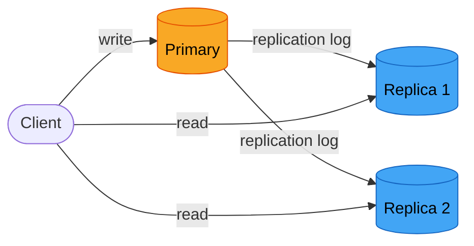
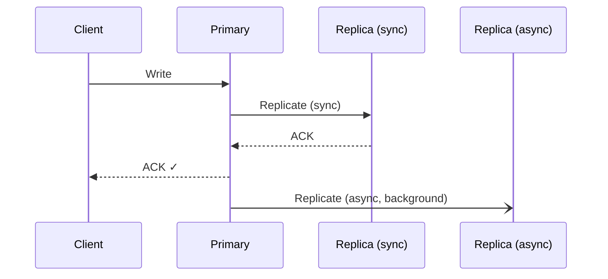
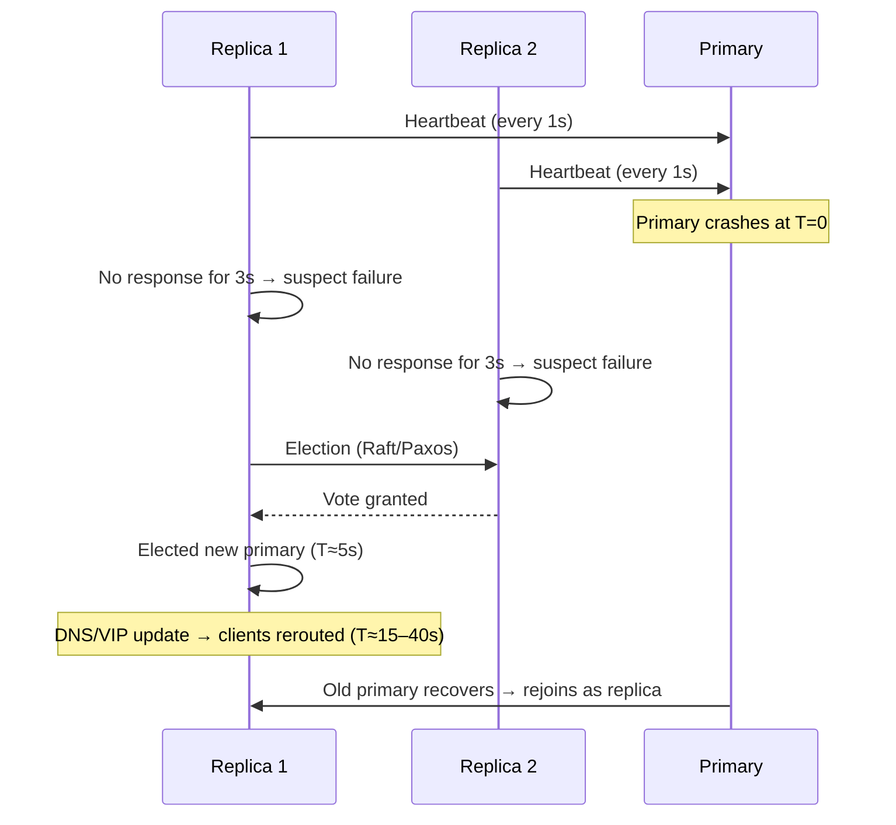
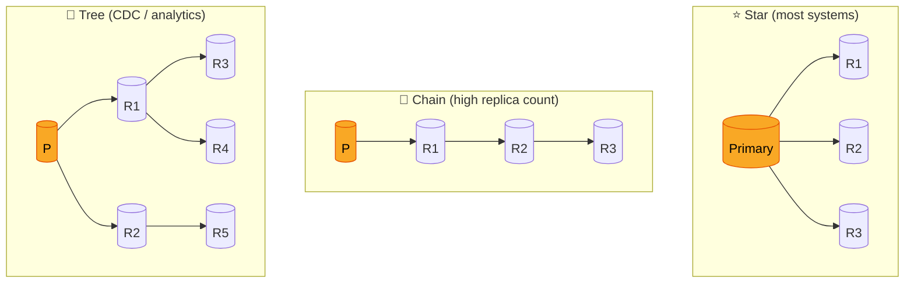

<!-- tldr -->
# Replication

Replication keeps multiple copies of the same data on different machines. It solves three independent problems simultaneously: a single machine is a single point of failure, a single performance ceiling, and a single geographic location. Every distributed database you will ever design depends on understanding the tradeoffs between topology, synchrony, and replication factor.



<!-- standard -->

## What It Is

Replication means maintaining N physical copies of the same dataset, each on an independent node. Writes propagate from the origin to every copy via a **replication log** (WAL in Postgres, binlog in MySQL, oplog in MongoDB). Reads can be served from any copy, depending on the consistency level required.

**The four motivations:**

- **High availability** — 3 replicas: P(all fail simultaneously) ≈ 0.0001% at 99% individual uptime
- **Read scalability** — 1 primary + 5 replicas = 6× read throughput
- **Geographic distribution** — local replica: ~10ms; cross-region: ~200ms
- **Durability** — 3 replicas on independent nodes → MTTF > 100 years

> ⚠️ **Replication is not a backup.** A bug, accidental delete, or corruption replicates to every copy instantly. Backups with point-in-time recovery are a separate concern.

## Primary Topologies

| Topology | Writers | Consistency | Conflict Risk | Best For |
|---|---|---|---|---|
| **Primary-Replica** | 1 | Strong (primary reads) / Eventual (replica reads) | None | Most OLTP workloads |
| **Multi-Primary** | N | Eventual | High | Active-active geo-distribution |
| **Quorum (W+R>N)** | Any | Tunable | Depends on W/R | Wide-column stores (Cassandra, DynamoDB) |

## Synchronous vs. Asynchronous

| Mode | Write Latency (same DC) | Write Latency (cross-region) | RPO on Primary Failure |
|---|---|---|---|
| Synchronous | ~12ms | ~110ms | 0 (zero data loss) |
| Asynchronous | ~5ms | ~5ms | > 0 (in-flight writes lost) |
| Semi-synchronous | ~8ms | ~15ms | Near-zero (1 confirmed copy) |

**Semi-synchronous is the correct default** for most production databases: sync to at least one replica before ACKing, async to the rest.



## Quorum Formula

```
W + R > N  →  guaranteed to read the latest write
```

| Config | W+R vs N | Consistency | Systems |
|---|---|---|---|
| W=2, R=2, N=3 | 4 > 3 | Strong | Cassandra QUORUM |
| W=1, R=1, N=3 | 2 ≤ 3 | Eventual | Cassandra ONE |
| W=3, R=1, N=3 | 4 > 3 | Strong (slow writes) | Cassandra ALL |

<!-- deep -->

## Deep Dive

### Primary-Replica in Detail

The write path is deterministic:

1. Client writes to primary
2. Primary applies to local storage
3. Primary appends to replication log (WAL / binlog / oplog)
4. Replicas pull log, apply sequentially
5. Primary ACKs client (sync or async depending on config)

**Failure mode:** Primary is a SPOF for writes. Automated failover takes **15–40 seconds** end-to-end (heartbeat timeout 3s + election 2–5s + DNS/VIP propagation 10–30s). Any writes acknowledged by the old primary but not yet replicated are lost unless semi-sync was enabled.

### Multi-Primary Conflict Resolution

Concurrent writes to different primaries produce divergent state. Four resolution strategies:

1. **Last-Write-Wins (LWW):** Higher timestamp wins. Risk: clock skew causes silent data loss. Used by Cassandra, DynamoDB.
2. **Application-defined merge:** Business logic resolves; e.g., shopping cart union, counter sum. Used by Amazon Dynamo.
3. **Version vectors:** Detect and surface both values to the application for explicit resolution.
4. **CRDTs:** Data structures that auto-merge without conflict — G-Sets, OR-Sets, PN-counters. Used by Redis (CRDT Enterprise), Riak, Automerge.

**Avoid multi-primary for:** financial ledgers, inventory counts, distributed locks — anywhere correctness trumps availability.

### Replication Lag Anomalies

| Anomaly | Symptom | Fix |
|---|---|---|
| Read-your-writes | User updates profile, refreshes, sees old data | Route user's own reads to primary; or track write timestamp and wait for replica to catch up |
| Monotonic reads | A post "disappears" then reappears across requests | Sticky sessions: pin each user to one replica |
| Consistent prefix | Bob's reply appears before Alice's original message | Enforce causal ordering in the replication log |

**Monitoring thresholds:**

```
Warning:  replication_lag > 1s
Critical: replication_lag > 10s
Page:     replication_lag > 60s  (replica may never catch up under load)
```

```sql
-- MySQL
SHOW SLAVE STATUS\G
-- Seconds_Behind_Master: 0   ← healthy
-- Seconds_Behind_Master: 30  ← alert
```

### Failover and Split-Brain



**Split-brain prevention:** Require a quorum (majority) to elect a leader. A minority partition cannot form a quorum, so at most one primary can exist at any time.

**Tools that implement this:**

- **Raft:** etcd, CockroachDB, TiDB — strong consistency, linearizable reads
- **Paxos:** MySQL Group Replication — built-in automatic failover
- **Patroni:** PostgreSQL HA using etcd/Consul/ZooKeeper for leader election
- **Redis Sentinel:** Monitors Redis, promotes replica on primary failure

### Replication Topologies



| Topology | Best For | Tradeoff |
|---|---|---|
| Star | < 10 replicas, most systems | Primary is network bottleneck at high replica count |
| Chain | Very high replica count | Higher end-to-end lag; middle-node failure breaks chain |
| Tree | 100+ replicas (CDC, analytics) | Intermediate failure affects entire subtree |
| Multi-primary | Active-active geo-distribution | Conflict resolution required; O(N²) connections |

### Replication Factor Decision Rubric

| N | Survives | Storage Cost | Use Case |
|---|---|---|---|
| 2 | 1 failure | 2× | Minimum for production; avoid if possible |
| 3 | 1 failure + 1 maintenance window | 3× | **Industry default** for most services |
| 5 | 2 simultaneous failures | 5× | Financial, health, auth — critical data |

**Cross-AZ minimum:** Place replicas in different AZs/regions. N=3 across 3 AZs survives an entire AZ outage. This is the baseline expectation at FAANG.

**Hybrid production pattern (most common):**

- Synchronous replication *within* a region (2 AZs, ~2ms RTT) → RPO = 0
- Asynchronous replication *to* secondary region (100ms+ RTT) → disaster recovery
- Result: near-zero data loss for 99.9% of failures, low write latency

### Capacity and Latency Numbers

| Operation | Same DC | Cross-region (US–EU) |
|---|---|---|
| Sync write (primary + 1 replica) | ~12ms | ~110ms |
| Async write (primary only) | ~5ms | ~5ms |
| Quorum read (R=2, N=3) | ~8ms | ~105ms |
| Replica lag (healthy, async) | 10–100ms | 100–1000ms |
| Replica lag (heavy write load) | Up to seconds | Up to tens of seconds |
| Automated failover RTO | 15–40s | 15–40s |

At **1M writes/s**, a replication factor of 3 means your storage and I/O layer must absorb **3M writes/s**. Plan accordingly.

### Interview Pitfalls

1. **"Add more replicas to scale writes."** Wrong. Primary-replica only scales *reads*. Writes still serialize through one primary. You need sharding for write scale.
2. **"Sync replication is always safer."** True for RPO, but a slow or unavailable replica blocks *all* writes. Sync replication turns a replica failure into a primary unavailability.
3. **"W+R=N is fine."** It is not. `W + R > N` (strictly greater) is required to guarantee overlap. `W+R=N` creates an edge case with no overlap.
4. **Forgetting split-brain.** Any failover design that doesn't address split-brain will fail in a network partition. Always ask: "What prevents two nodes from both believing they are primary?"
5. **Treating replication as backup.** A `DELETE FROM users` replicates in milliseconds. Backups are separate.

### When to Reach for Each Strategy

```
Need zero data loss (RPO=0)?
  → Synchronous replication + quorum writes (W+R>N)

Need low write latency, can tolerate small data loss window?
  → Asynchronous replication + semi-sync as floor

Need writes from multiple geographic regions independently?
  → Multi-primary with CRDTs or LWW; accept conflict complexity

Need 100+ read replicas for analytics / reporting?
  → Tree topology with async replication from primary

Standard production web service?
  → N=3, semi-sync, primary-replica, one quorum read config
```