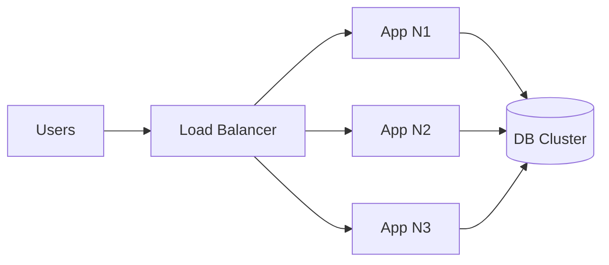
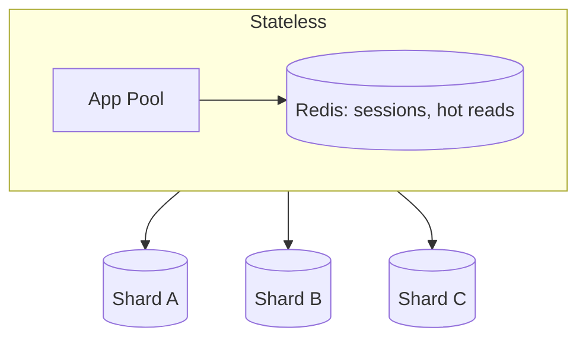
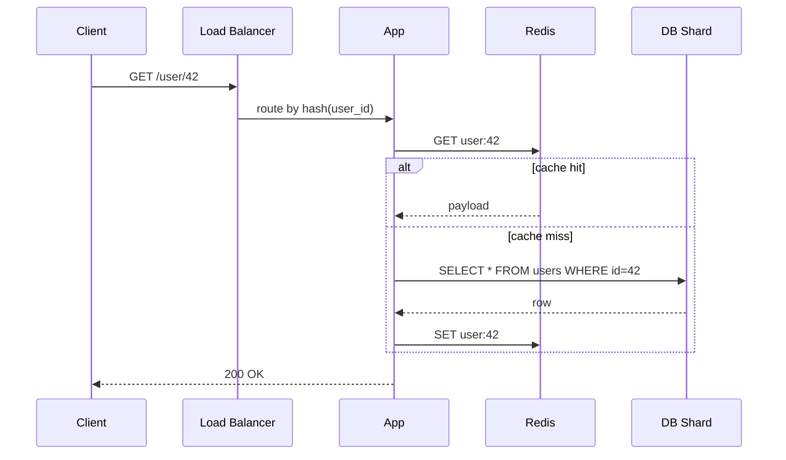

<!-- tldr -->
# Scalability

A system is **scalable** if you can grow capacity (users, data, requests) without rewriting it. Two axes: **vertical** (bigger box, simple but capped) and **horizontal** (more boxes, elastic but distributed). Real systems use both, weighted toward horizontal at scale.

<!-- standard -->

## What it actually means

Scaling = handling more **without proportional latency or failure increase**. If you 10× the load, p99 should not 10× too.

## The two axes

| | Vertical (Scale-up) | Horizontal (Scale-out) |
|---|---|---|
| Mechanism | Bigger CPU/RAM/disk | More machines behind a balancer |
| Limit | Hardware ceiling | Coordination overhead |
| Failure mode | Single point of failure | Tolerates node loss |
| Cost shape | Exponential at the top | Roughly linear |
| Easy for | Stateful workloads | Stateless workloads |

## What you usually do

1. **Make the app stateless** — push session/data to Redis/DB.
2. **Put a load balancer in front** — round-robin or least-connections.
3. **Shard the data layer** — by user ID, geography, or hash.
4. **Add a cache** — read-through Redis in front of DB to absorb hot keys.
5. **Auto-scale on signal** — CPU, queue depth, p95 latency.

## Common pitfalls

- A "scalable" service backed by a single Postgres → not scalable.
- Auto-scaling on CPU alone misses I/O-bound bottlenecks.
- Sticky sessions break horizontal scaling — use a shared session store.

<!-- deep -->

## Capacity numbers worth memorising

- A modern x86 box: ~50k QPS for a simple web service, lower with DB hits.
- Redis: ~100k ops/sec per node, sub-ms p99.
- Postgres: ~10–30k TPS with good schema; collapses on lock contention.
- Cross-AZ network: ~1ms RTT, ~100Gbps; cross-region: 50–150ms RTT.

## Auto-scaling that doesn't lie

- **Trigger on the right signal.** CPU is a proxy, not a metric. Better: queue depth, in-flight requests, p95 latency.
- **Cooldown periods** prevent flapping — but too long and you eat a brownout.
- **Pre-warm** before known spikes (Black Friday, scheduled jobs). Cold pools take 30–120s on most clouds.

## When horizontal stops being free

Stateless services scale linearly. Stateful ones don't:

- **Cross-shard transactions** force 2PC or sagas, both painful.
- **Joins** become app-side joins or denormalised reads.
- **Resharding** (rebalancing) is downtime risk; consistent hashing softens it.

## Decision rubric (interview-ready)

- **One box not enough?** Vertical scale first if the workload is stateful and the ceiling is far. Cheaper than rewriting.
- **Reads dominate?** Add a cache, then read replicas, then CDN. In that order.
- **Writes dominate?** Shard. Pick the partition key carefully — by user/tenant most often.
- **Hot keys?** Consistent hashing + per-key request coalescing.
- **Spiky traffic?** Auto-scale the stateless tier, queue the writes (SQS/Kafka), drain at steady rate.

## Pitfalls interviewers love

- Hand-waving "we'll just add more servers" without addressing the data layer.
- Forgetting that auto-scaling has a cold-start cost.
- Choosing a partition key that creates hotspots (e.g. `created_at` on insert-heavy tables).
- Saying "horizontally scalable" about anything Postgres-backed without naming the sharding strategy.
