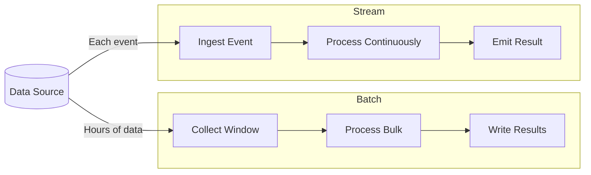
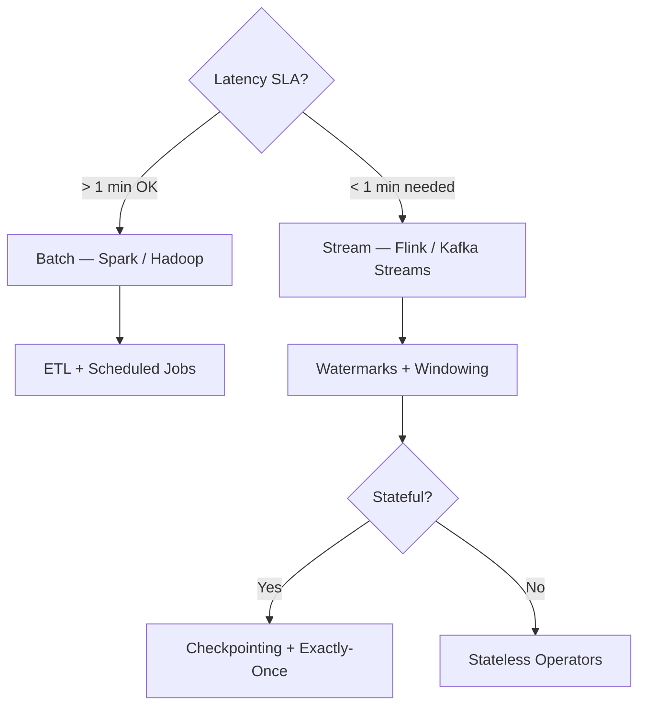
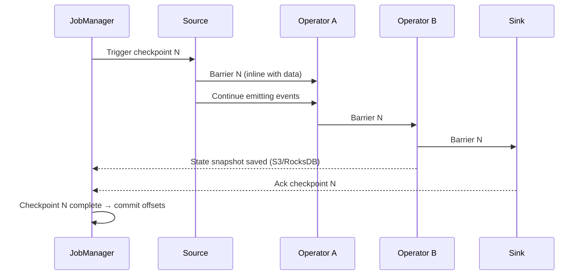
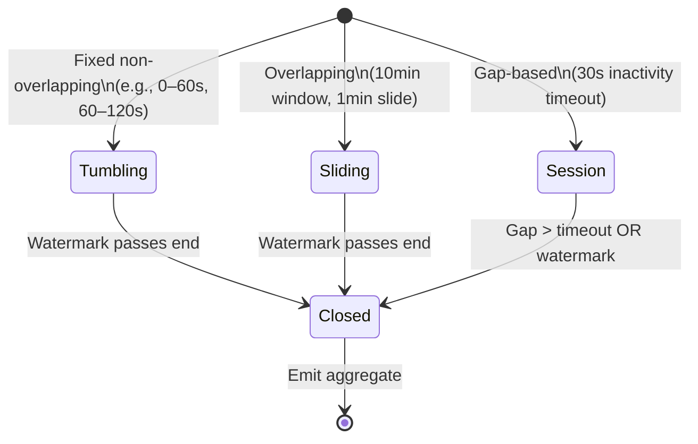
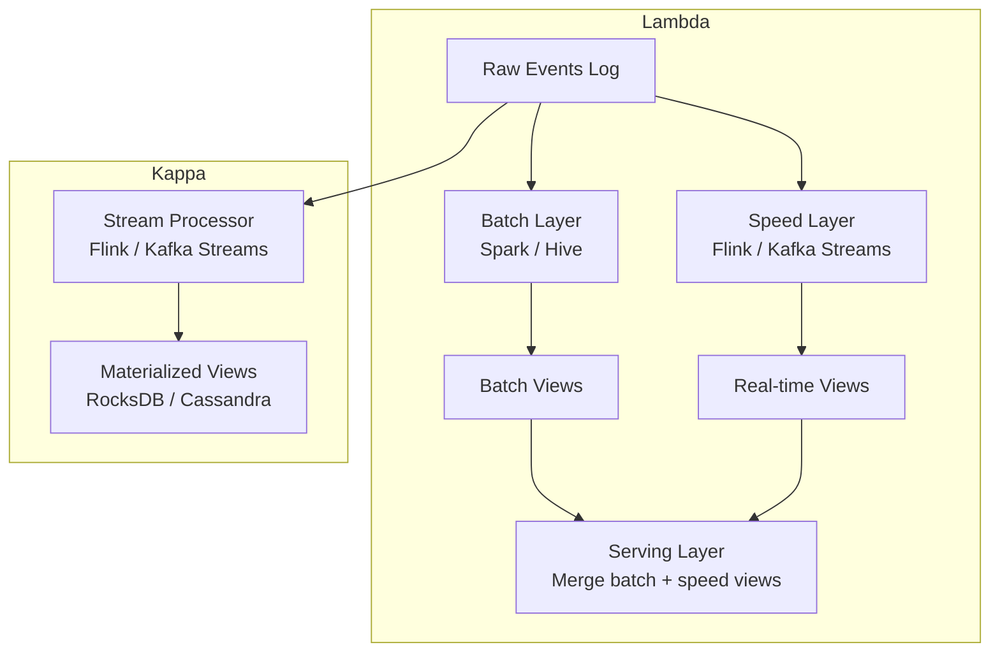

<!-- tldr -->
# Streaming vs Batch Processing

Data processing architectures sit on a spectrum anchored by two forces: **latency** (how fast a single event gets a result) and **throughput** (how many events per second the system sustains). Batch systems collect data into fixed windows and process them together, achieving high per-record efficiency at the cost of minutes-to-hours of delay. Stream processors handle each event (or micro-batch) continuously, targeting sub-second latency with stateful, fault-tolerant operators.



<!-- standard -->

## What It Is

**Batch processing** reads an immutable snapshot of data, applies transformations (ETL), and writes results — typically on a schedule (hourly, daily). The canonical stack is HDFS + MapReduce / Spark + Airflow. Because input is immutable and operations are deterministic, exactly-once semantics come for free and failed jobs are trivially re-run.

**Stream processing** treats data as an unbounded, append-only log. Frameworks like Apache Flink, Kafka Streams, and Spark Structured Streaming maintain **stateful operators** that update running aggregations as each event arrives.

## Why It Matters

| Dimension | Batch | Stream |
|---|---|---|
| Latency | Minutes → Hours | Milliseconds → Seconds |
| Throughput efficiency | High (amortized I/O) | Lower per record |
| State management | Recomputed each run | Maintained continuously |
| Fault recovery | Re-run from start | Checkpoint + replay |
| Exactly-once | Natural | Requires 2-phase commit |
| Operational complexity | Low | High |

## Primary Techniques

- **MapReduce / Spark batch**: Map → Shuffle/Sort → Reduce. Spark replaces disk I/O with in-memory RDDs/DataFrames, yielding 10–100× speedup for iterative workloads.
- **Windowing** (stream): Tumbling (non-overlapping), Sliding (overlapping), Session (gap-based). Windows convert infinite streams into finite sets for aggregation.
- **Watermarks**: An assertion that no event with event-time *t* will arrive after the watermark advances past *t*. Controls the latency/completeness trade-off for late data.
- **Lambda architecture**: Batch layer for accuracy + Speed layer for recency, merged at serving time. Operational cost: duplicate business logic.
- **Kappa architecture**: Single stream processor with long log retention for replay. Simpler ops, but reprocessing requires replaying the full log.

## Key Trade-offs

- **Event time vs. processing time**: Business metrics (revenue, clicks) require event-time windows; system health metrics can use processing time.
- **Stateless vs. stateful**: Stateless ops (filter, map) are trivially parallelisable; stateful ops (joins, aggregations) require co-partitioning and checkpointing.
- **Micro-batch vs. true streaming**: Spark Structured Streaming batches at ~100 ms intervals; Flink processes record-by-record. Micro-batch simplifies semantics but adds irreducible latency.



<!-- deep -->

## Deep Dive

### Batch Processing Internals

#### MapReduce Execution Model

```
Input splits → Map (emit k/v) → Shuffle/Sort (group by k) → Reduce (aggregate)
```

- Each map task processes one HDFS block (~128 MB default).
- Shuffle is the bottleneck: 100 GB dataset with 3× replication = ~300 GB network I/O.
- MapReduce writes intermediate results to disk between every stage → 2–5× I/O amplification vs. Spark.

#### Apache Spark

Spark builds a **DAG** of transformations; the Catalyst optimizer rewrites it before physical execution.

- `filter` pushed before `join` reduces shuffle data by orders of magnitude.
- `persist(MEMORY_AND_DISK)` allows iterative ML algorithms (e.g., gradient descent, PageRank) to run 100× faster than MapReduce.
- Structured Streaming reuses the same Catalyst engine, providing a unified API.

**Real numbers**: A 1 TB Parquet join on a 100-node Spark cluster (each node: 32 vCPU, 128 GB RAM) completes in ~8 min. Equivalent MapReduce job: ~80 min.

---

### Stream Processing Internals

#### Watermarks and Late Data

```
Watermark(t) = max(observed_event_time) − allowed_skew
```

- **Conservative** (skew = 5 min): windows close 5 min late, more complete results, 5 min added latency.
- **Aggressive** (skew = 0): windows close immediately, some late events dropped.
- **Allowed lateness** (Flink/Beam): emit a preliminary result when watermark passes, then re-emit corrected result if late events arrive within the grace period.

#### Flink Checkpointing (Chandy-Lamport)



- Barriers flow through the dataflow graph without stopping processing.
- All operators snapshot state when they receive the barrier on all input channels.
- On failure: rollback to checkpoint N, re-read from Kafka offset recorded at N → exactly-once end-to-end.
- Checkpoint interval trade-off: every 1 s → low recovery lag but ~5% throughput overhead; every 30 s → minimal overhead but up to 30 s of reprocessing on restart.

#### Flink State Backends

| Backend | Heap RAM | State Size | P99 Read Latency |
|---|---|---|---|
| MemoryStateBackend | Full state in JVM heap | < 1 GB | < 1 ms |
| FsStateBackend | In JVM heap, snapshots to HDFS/S3 | < 10 GB | < 1 ms (reads in-memory) |
| RocksDBStateBackend | Off-heap, local SSD | Terabytes | 2–10 ms |

Use **RocksDB** for any production stateful job processing > 10 GB of key state.

---

### Windowing Deep Dive



- **Tumbling** windows: each event in exactly one window. Best for regular reporting (hourly revenue).
- **Sliding** windows: event in `window_size / slide` windows. Higher CPU; good for rolling P99 latency dashboards.
- **Session** windows: window size determined by data. Ideal for user session analytics. Require merging state when a late event bridges two previously separate sessions.

---

### Lambda vs Kappa Architecture



| | Lambda | Kappa |
|---|---|---|
| Code duplication | Yes — batch + stream | No |
| Historical reprocessing | Natural (re-run batch) | Replay entire log |
| Operational complexity | High (two clusters) | Low (one cluster) |
| Accuracy | Highest | High (bounded by log retention) |
| Adoption | LinkedIn, Twitter (legacy) | Uber (uReplicator), Cloudflare |

**When to choose Kappa**: you have long Kafka retention (weeks), stream logic covers all required transformations, and you want a single deployment surface.

**When to choose Lambda**: regulatory or audit requirements demand provably correct historical aggregates recomputed from raw data, or batch jobs are already deeply embedded in your org.

---

### Real-World Systems

| System | Pattern | Key Detail |
|---|---|---|
| Apache Kafka | Durable log + Streams | Compacted topics implement stream-table duality |
| Apache Flink | True stream + batch unification | Chandy-Lamport checkpoints, RocksDB state |
| Apache Spark | Micro-batch streaming + batch | Catalyst optimizer, 100 ms micro-batch floor |
| Cassandra | Serving layer for stream output | Tunable consistency for high-write materialized views |
| DynamoDB Streams | CDC for event-driven pipelines | At-least-once delivery, 24 h retention |
| Google Dataflow / Beam | Unified batch+stream model | Watermarks + triggers as first-class API |

---

### Failure Modes

- **Watermark stalls**: a single slow Kafka partition holds back the watermark for the entire job → windows never close. Mitigation: idle source timeout (Flink `withIdleness(Duration.ofSeconds(30))`).
- **State size explosion**: unbounded `MapState` without TTL causes OOM or RocksDB compaction storms. Always set `StateTtlConfig`.
- **Backpressure cascades**: a slow sink (e.g., overloaded database) propagates upstream, increasing end-to-end latency past SLA.
- **Clock skew**: producer clocks drifting by minutes makes event-time watermarks overly conservative; monitor `currentInputWatermark` lag metric.
- **Exactly-once overhead**: 2-phase commit adds 50–200 ms commit latency per checkpoint barrier. Disable for non-financial pipelines where at-least-once is acceptable.

---

### Capacity & Latency Reference Numbers

| Scenario | Typical Figures |
|---|---|
| Flink job P99 event-to-output latency | 50–200 ms (Kafka → Kafka) |
| Kafka consumer throughput per partition | 100–150 MB/s |
| Spark batch job, 1 TB Parquet | 5–15 min on 100 nodes |
| Flink checkpoint interval (production) | 10–30 s |
| RocksDB state read | 2–10 ms |
| Watermark-induced window delay | Configured skew tolerance (e.g., 5 min) |
| Kafka log retention for Kappa replay | 7–30 days typical, weeks of replay |

---

### Interview Pitfalls

1. **Saying "Kafka is a streaming processor"** — Kafka is a durable log/broker. Kafka *Streams* is the processing library. Flink/Spark are the processors.
2. **Ignoring late data** — interviewers expect you to discuss watermarks and allowed lateness for any event-time aggregation.
3. **Conflating at-least-once and exactly-once** — exactly-once requires idempotent sinks *or* transactional writes (2PC). Spell out which mechanism you'd use.
4. **Over-engineering with Lambda** — modern Flink/Beam handle batch and stream in one engine; default to Kappa unless you have a concrete reason for Lambda.
5. **Forgetting the serving layer** — stream output lands in a store (Cassandra, Redis, DynamoDB). The database choice affects read latency, consistency, and fan-out.

---

### Decision Rubric: When to Reach for Each

```
Latency SLA > 5 min AND workload is periodic?
  → Batch (Spark on HDFS/S3)

Latency SLA < 1 min OR need continuous results?
  → Stream (Flink if complex stateful logic; Kafka Streams if Kafka-native & ops simplicity matters)

Need both accurate historical + real-time AND team can maintain two systems?
  → Lambda

Kafka retention ≥ 2 weeks AND single processing model acceptable?
  → Kappa

Complex event-time windowing, large state, exactly-once guarantees?
  → Apache Flink + RocksDB state backend

Simple SQL-style stream transformations on Kafka topics?
  → KSQL / ksqlDB
```