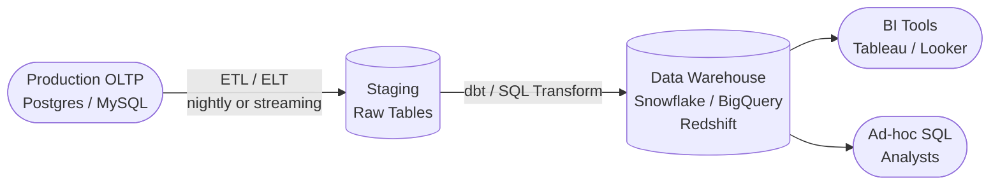
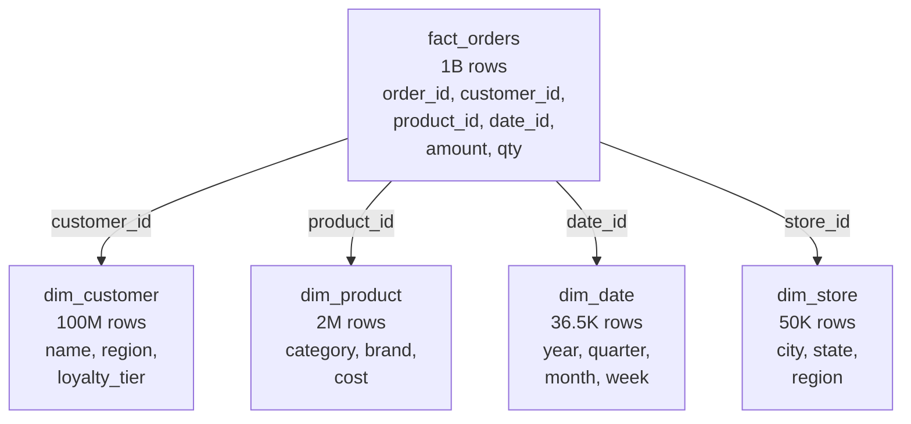
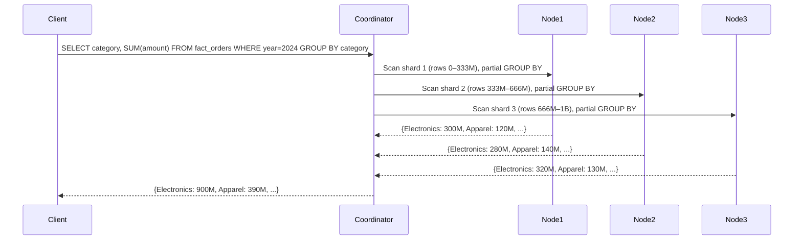
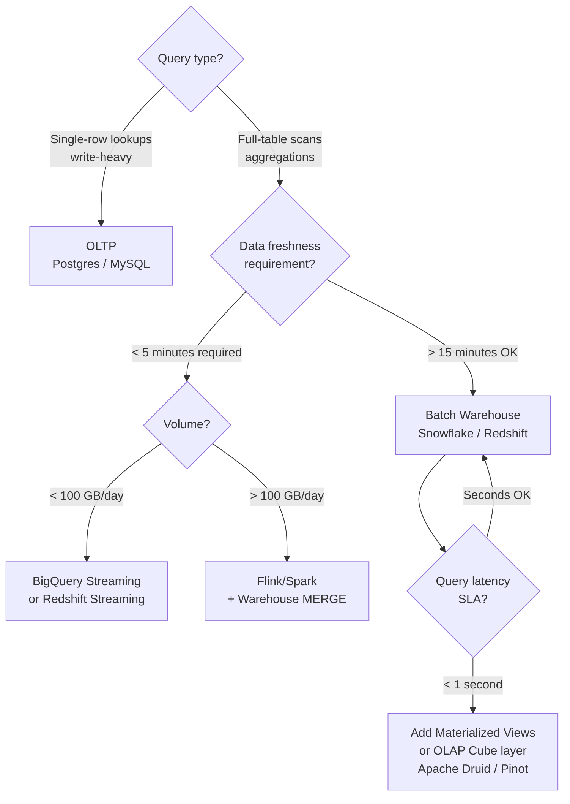

<!-- tldr -->
# Data Warehousing and OLAP

OLTP databases are tuned for small, fast, consistent writes — running a billion-row GROUP BY on your production Postgres will time out and take down the site. Data warehouses solve this with columnar storage, denormalized schemas, and massively parallel query execution. The core idea: separate the system of record from the system of insight and optimize each independently.



<!-- standard -->

## What It Is

A **data warehouse** is a read-optimized analytical store that ingests data from one or more operational systems, reshapes it for querying, and serves business intelligence workloads. **OLAP** (Online Analytical Processing) describes the query pattern: full-table scans, multi-dimensional aggregations, and GROUP BY over billions of rows.

## Why It Matters

| Dimension | OLTP | OLAP |
|---|---|---|
| Workload | Many small writes & point reads | Few large scans & aggregations |
| Query shape | Specific rows, all columns | All rows, few columns |
| Storage layout | Row-oriented (normalized, 3NF) | Column-oriented (denormalized) |
| Acceptable latency | < 100 ms | Minutes to hours |
| Consistency model | Strong (ACID) | Eventually consistent |
| Compression ratio | ~1–2× | **10–100×** |
| Example systems | PostgreSQL, MySQL, Aurora | Snowflake, BigQuery, Redshift |

Running analytics on OLTP causes table locks, cache eviction, and degraded write throughput. Separation is not optional at scale.

## Primary Techniques

- **Columnar storage** — store each column contiguously on disk. Reading `SUM(revenue)` touches one column file, not all 100. Dictionary + run-length encoding compresses repeated values (e.g., `status = 'completed'` 95% of the time) by 10–100×.
- **Star schema** — one central fact table (billions of rows, FK references) surrounded by small dimension tables (thousands–millions of rows). Fewer joins, simpler queries, partition pruning on date dimension.
- **Snowflake schema** — normalize dimensions into sub-dimensions. Slightly less storage; extra join cost. Use only when dimension tables themselves exceed tens of millions of rows.
- **ETL vs ELT** — classic ETL transforms outside the DB (slow, brittle). Modern ELT loads raw data into a staging area first, then transforms with SQL inside the warehouse (fast, parallel, auditable). Tools: Fivetran/Airbyte (extract-load) + dbt (transform).
- **MPP** — shard the fact table across N nodes. Each node scans its slice in parallel; a coordinator merges partial aggregates. 20 nodes → ~20× speedup on scan-heavy queries.

## Key Tradeoffs

- Columnar is terrible for single-row inserts; always bulk-load in warehouse ingestion.
- Denormalization trades storage for query simplicity — columnar compression makes the storage cost negligible.
- Shuffles in MPP (when GROUP BY key ≠ shard key) are 10× slower than local aggregation; choose distribution keys carefully.
- Materialized views cut query latency to milliseconds but require refresh schedules and add storage.



<!-- deep -->

## Columnar Storage: Algorithms & Numbers

### Encoding Strategies

| Technique | Best For | Compression |
|---|---|---|
| Dictionary encoding | Low-cardinality strings (`status`, `country`) | 5–50× |
| Run-length encoding (RLE) | Sorted or repeated values | 10–1000× |
| Delta encoding | Monotonic sequences (timestamps, IDs) | 3–10× |
| Bit-packing | Small integers | 2–8× |
| Zstandard / Snappy | General fallback | 2–4× |

**Real numbers:** A 1 TB fact table in row format compresses to 10–100 GB columnar. BigQuery's public NYC Taxi dataset (1.1B rows, 17 columns) is ~50 GB on disk vs ~800 GB row-oriented equivalent — 16× compression before query-time decompression.

### I/O Amplification Formula

```
blocks_read = (columns_touched / total_columns) × total_blocks × (1 / compression_ratio)
```

A query touching 3 of 50 columns on a 1 TB table with 20× compression reads:
`(3/50) × 1 TB / 20 = 3 GB` — vs 1 TB for row-oriented. That's a **333× I/O reduction**.

---

## Star Schema: Design Rules

### Fact Table Design

- **Grain**: define the atomic unit. `fact_orders` at order-line level is finer than order level — never mix grains in one table.
- **Additive metrics**: `amount`, `quantity` — safe to SUM across any dimension.
- **Semi-additive**: `account_balance` — can SUM across customers but not time.
- **Non-additive**: `margin_pct` — never SUM; always compute from additive components.
- **Degenerate dimensions**: order_number with no dimension table; store directly in fact.

### Slowly Changing Dimensions (SCD)

Dimension values change over time (customer moves city, product changes category). Three strategies:

| Type | Behavior | Use When |
|---|---|---|
| SCD Type 1 | Overwrite old value | History doesn't matter |
| SCD Type 2 | New row with `valid_from`/`valid_to` | Full history required |
| SCD Type 3 | Add `prev_value` column | Only prior value needed |

Type 2 is the standard for warehouses. `dim_customer` grows over time but stays small relative to the fact table.

---

## MPP Architecture: How Real Systems Do It



### Distribution Key Selection

**Redshift:** `DISTKEY(customer_id)` — colocates fact rows with same customer on same node, eliminates shuffle for customer-level aggregations. `SORTKEY(order_date)` — physical sort order enables zone maps (skip blocks where date out of range).

**BigQuery:** Partitioning on `DATE(order_created_at)` with clustering on `(category, region)` gives partition pruning + sorted micro-blocks.

**Snowflake:** `CLUSTER BY (order_date, category)` — automatic micro-partition clustering; query optimizer prunes ~90% of micro-partitions for date-filtered queries.

### Shuffle Cost Reality

A full shuffle on 1B rows across 20 nodes at 10 Gbps network:
- Data volume: ~50 GB after columnar compression
- Network time: 50 GB / (10 Gbps / 8) = ~40 seconds just for transfer
- Plus sort/merge: total easily 2–5 minutes

Choosing the right distribution key can reduce this to near-zero. In interviews: always ask about the most common GROUP BY pattern before recommending a distribution key.

---

## Real-World Systems

### Snowflake
- Separates storage (S3) from compute (virtual warehouses). Scale compute independently; storage billed at S3 rates.
- Micro-partition architecture: 50–500 MB immutable files, each with min/max metadata for pruning.
- Query P99 on 1B rows with good clustering: **< 10 seconds**.

### Google BigQuery
- Serverless; no cluster sizing. Columnar storage in Capacitor format.
- Dremel execution engine: tree of query servers, leaf nodes read storage.
- Pricing: $5/TB scanned (on-demand). Partition + clustering can cut scanned bytes by 95%, lowering cost proportionally.
- Streaming inserts: 1M rows/sec per project, available for queries within seconds — real-time OLAP.

### Amazon Redshift
- Shared-nothing MPP with dense-compute or RA3 (managed storage) nodes.
- AQUA (Advanced Query Accelerator): hardware-accelerated FPGA nodes for scan-heavy workloads, claimed 10× speedup.
- Redshift Spectrum: query S3 directly without loading; useful for cold data.

### Apache Kafka + Flink → Warehouse (Real-Time)
Lambda / Kappa architectures for sub-minute latency:
- Flink aggregates streaming events into 1-minute tumbling windows → writes to warehouse staging
- Warehouse merges with historical data via MERGE/UPSERT
- Result: dashboards with **< 5 minute data freshness** vs 1-hour ETL batch

---

## Optimization Techniques

### Partition Pruning
```sql
-- Warehouse sees: WHERE date_id BETWEEN 20240101 AND 20241231
-- Only Q4 partitions scanned; rest skipped at file/block level
-- Savings: 75% of data skipped for one-quarter query
```

### Materialized Views
Pre-compute expensive aggregations; refresh on a schedule or incrementally:
```sql
CREATE MATERIALIZED VIEW revenue_by_cat_month
REFRESH NIGHTLY AS
SELECT
  p.category,
  DATE_TRUNC('month', d.date) AS month,
  SUM(f.amount)               AS revenue
FROM fact_orders f
JOIN dim_product p USING (product_id)
JOIN dim_date    d USING (date_id)
GROUP BY 1, 2;
-- Query time: 5 min → <10 ms
```

Cost: storage (usually < 1% of fact table size) + refresh compute (billed once, not per query).

### Z-Ordering / Multi-Dimensional Clustering
Delta Lake and Iceberg support Z-order clustering on multiple columns simultaneously. Useful when queries filter on both `(date, region)` — standard single-key sorting can only prune on one dimension.

---

## Failure Modes

| Failure | Symptom | Fix |
|---|---|---|
| Hot partition | One node at 100% CPU; others idle | Re-shard on higher-cardinality key |
| Cartesian join | Query runs indefinitely | Add join predicate; check for missing FK |
| SCD Type 2 explosion | dim_customer grows to fact-table size | Archive old rows; add `is_current` filter index |
| Stale materialized view | Dashboard shows yesterday's data | Alert on refresh lag; add `last_refresh_ts` monitoring |
| Skewed distribution | 80% rows on 2 of 20 nodes | Use composite distribution key or hash(customer_id % 1000) |

---

## Capacity & Latency Reference Numbers

| Metric | Typical Value |
|---|---|
| Columnar compression ratio | 10–100× |
| BigQuery scan speed | ~1 TB/sec per slot |
| Redshift RA3 node throughput | ~2 GB/s per node |
| Shuffle network cost | 10–50× vs local aggregation |
| Materialized view query latency | < 10 ms |
| ELT pipeline freshness (batch) | 15 min – 1 hour |
| Streaming insert freshness (BigQuery) | < 60 seconds |
| Star schema join on 1B fact rows | 5–30 seconds (well-tuned) |

---

## Interview Pitfalls

1. **"I'd just use Postgres with indexes."** — Indexes don't help full-table scans; sequential columnar reads are faster than index lookups at analytical scale.
2. **Forgetting grain** — Interviewers probe: "What is one row in your fact table?" Know the grain before designing the schema.
3. **Ignoring distribution keys** — Saying "shard by hash" without specifying which column is a red flag. Ask: what does the most common GROUP BY look like?
4. **ETL as the default** — Modern answer is ELT + dbt. Mentioning ETL-only signals pre-2018 thinking.
5. **Confusing partitioning with sharding** — Partitioning is logical (within one system); sharding is physical (across nodes). Redshift does both. BigQuery partitions are logical but map to physical storage segments.
6. **Ignoring SCD** — "Customers can change addresses" is a classic follow-up. Have Type 1/2/3 ready.

---

## When to Reach for a Data Warehouse



**Decision rubric:**
- **Batch warehouse** (Snowflake, BigQuery, Redshift): default choice for BI/reporting with hourly freshness. Cost-effective, low ops overhead.
- **Real-time warehouse** (BigQuery Streaming, Redshift Streaming): when business needs sub-5-minute dashboards; 3–5× higher cost per row ingested.
- **Apache Druid / Apache Pinot**: sub-second OLAP on pre-aggregated time-series data (100M+ events/day, P99 < 100 ms). Used by Netflix, LinkedIn, Uber. Higher ops cost; use only when warehouse latency is unacceptable.
- **Hybrid (HTAP)**: SAP HANA, TiDB, SingleStore blur OLTP/OLAP. Valid for <10 TB where operational + analytical queries must share one system; not cost-effective at hyperscale.