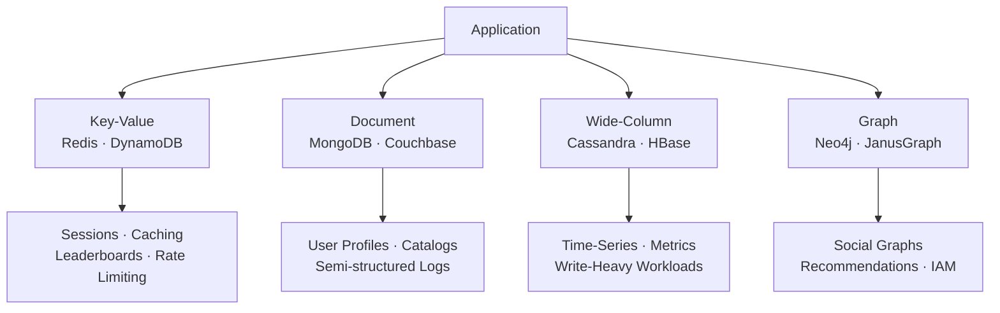
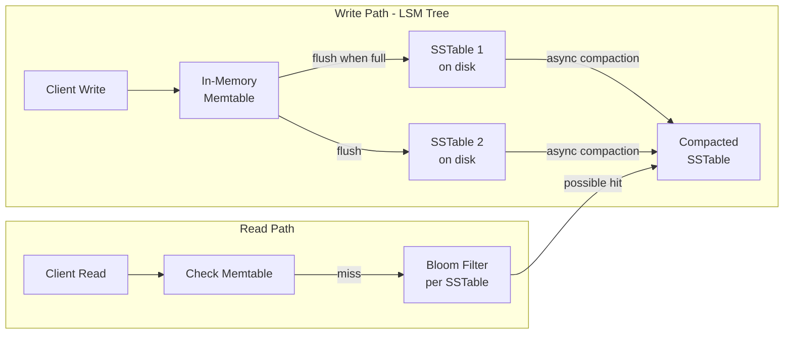
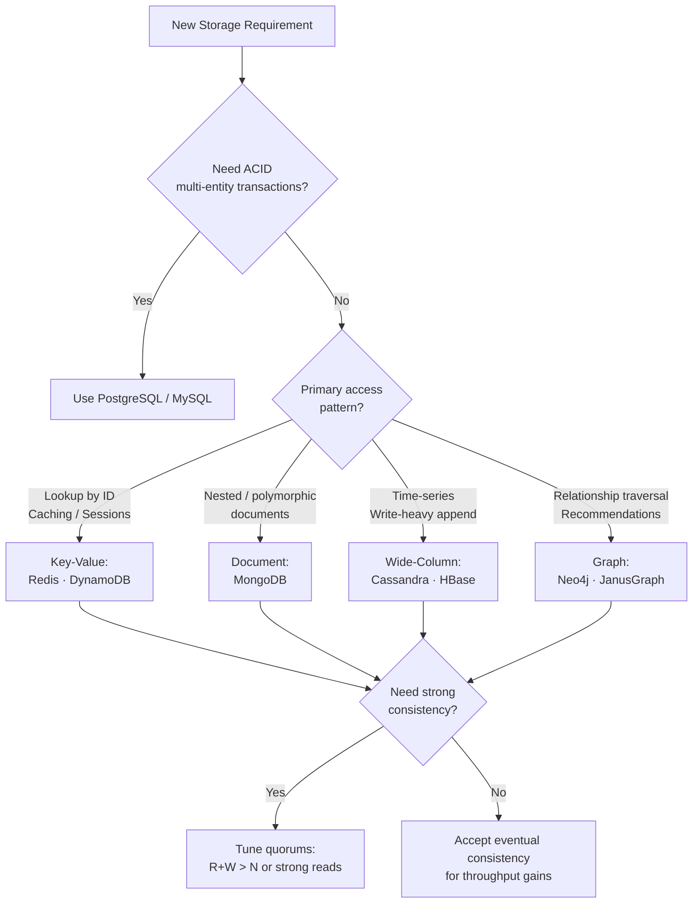

<!-- tldr -->
# NoSQL Databases

NoSQL encompasses four primary data models—key-value, document, wide-column, and graph—each optimized for different access patterns. They emerged to solve impedance mismatch, horizontal scalability limits, and write-heavy workloads that RDBMS systems handle poorly at scale. The unifying theme is trading some ACID guarantees for partition tolerance and operational flexibility. Choose your model based on access patterns first, consistency requirements second.



<!-- standard -->

## What It Is

NoSQL is an umbrella term for non-relational databases that abandon the strict tabular schema of SQL in favor of flexible data models designed for specific access patterns. The four canonical models are:

| Model | Core Abstraction | Best For | Weak At |
|---|---|---|---|
| Key-Value | `key → opaque value` | O(1) lookups, caching, sessions | Range queries, aggregations |
| Document | JSON/BSON document tree | Hierarchical data, ad-hoc queries | Complex transactions, large graphs |
| Wide-Column | Row key → column families | Time-series, sparse data, write-heavy | Complex queries, small result sets |
| Graph | Nodes + edges + properties | Relationship traversal, recommendations | Large-scale distributed graphs |

## Why It Matters

- **Impedance mismatch**: Modern apps deal in nested, polymorphic objects. Mapping them to 2D rows is friction.
- **Horizontal scaling**: SQL JOINs across shards are prohibitively expensive. NoSQL designs for distributed partitioning natively.
- **Write optimization**: LSM trees (Cassandra, RocksDB) buffer writes in memory and flush sequentially—far faster than B-tree random I/O.
- **Schema evolution**: Schema-on-read lets teams iterate without costly `ALTER TABLE` migrations on 10TB tables.

## Primary Techniques

- **Key-Value (Redis)**: In-memory hash table; supports strings, sorted sets, streams, HyperLogLog. Persistence via RDB snapshots or AOF. Single-threaded; P99 < 1ms at 1M QPS.
- **Document (MongoDB)**: BSON documents up to 16 MB; rich query language with index support; aggregation pipeline for multi-stage transforms; multi-document ACID since v4.0.
- **Wide-Column (Cassandra)**: LSM tree writes to memtable → SSTable; leaderless ring topology; tunable R/W quorums; CQL enforces query-first design.
- **Graph (Neo4j)**: Cypher query language; index-free adjacency means traversal cost is O(hops), not O(graph size); ACID within a single instance.

## Key Trade-offs

- **Flexibility vs. integrity**: No schema enforcement pushes validation to the application layer—a bug can corrupt millions of documents.
- **Availability vs. consistency**: Most NoSQL systems default to eventual consistency (BASE); strong consistency costs latency.
- **Write speed vs. read amplification**: LSM trees make writes fast but reads may touch multiple SSTables until compaction catches up.
- **Polyglot persistence** is the pragmatic answer: PostgreSQL for transactional orders, Redis for sessions, Cassandra for events, Neo4j for recommendations—each pulling its weight.



<!-- deep -->

## Deep Dive

### Key-Value Stores: Redis & DynamoDB

#### Redis Internals
Redis is single-threaded and in-memory. All data structures are implemented as specialized C structs (e.g., `ziplist` for small hashes, `skiplist` for sorted sets). Throughput: **1M+ QPS** on a single node, P99 < **0.5ms** for simple GET/SET.

**Hot Key Problem**: A celebrity's user ID receiving 500K RPS saturates the node owning that hash slot. Mitigations:
1. Application-level read replicas (`READONLY` on replica nodes)
2. Key sharding: prefix hot key with random suffix `user:1001:{0..9}`, fan-out reads, aggregate client-side
3. Local in-process cache with short TTL (50–500ms) for top-N hot keys

**Persistence trade-off**:
- RDB (snapshot): small file, fast restart, data loss up to snapshot interval (e.g., 5 min)
- AOF (append-only file): durability to last fsync (1s default), larger file, slower restart

#### DynamoDB Capacity Math
DynamoDB charges in Read Capacity Units (RCU) and Write Capacity Units (WCU):
- 1 RCU = 1 strongly consistent 4 KB read/s (or 2 eventually consistent reads)
- 1 WCU = 1 write up to 1 KB/s

For a table doing **10,000 writes/s at avg 512 bytes each** → 10,000 WCU. At $0.00065/WCU-hour ≈ **$113/day** provisioned. On-demand pricing scales automatically but costs ~6× more per unit at steady load.

**GSI fan-out**: A Global Secondary Index replicates writes asynchronously. A table with 3 GSIs means every write triggers 4 total writes (base + 3 GSIs)—factor this into WCU budgeting.

---

### Cassandra Deep Dive

#### Consistent Hashing & Vnodes

```mermaid
flowchart LR
    subgraph Cassandra Ring - RF=3
        N1((Node 1\nToken 0)) --> N2((Node 2\nToken 85))
        N2 --> N3((Node 3\nToken 170))
        N3 --> N4((Node 4\nToken 255))
        N4 --> N1
        KEY[Key hash=90] -->|clockwise| N3
        N3 -->|replica 2| N4
        N4 -->|replica 3| N1
    end
```

Each physical node owns **256 vnodes** by default. When a node is added, it steals token ranges from many neighbors simultaneously—rebalancing is parallelized across the cluster rather than draining a single node.

#### Tunable Consistency Formula

`R + W > N` → strong consistency

| Scenario | R | W | N | Effect |
|---|---|---|---|---|
| All-strong | 2 | 2 | 3 | Linearizable; higher latency |
| Read-optimized | 1 | 2 | 3 | Fast reads; eventual |
| Write-optimized | 2 | 1 | 3 | Fast writes; reads lag |
| `LOCAL_QUORUM` | ⌈N/2⌉+1 | ⌈N/2⌉+1 | N | Strong within DC; cross-DC async |

**Typical latency**: Write with `LOCAL_QUORUM` to 3-node cluster in same DC: P50 ~2ms, P99 ~10ms. Cross-DC replication adds 30–80ms depending on geography.

#### Compaction Strategy Selection

| Strategy | Write Amp | Read Amp | Best Use |
|---|---|---|---|
| STCS (default) | Low | Medium | General workloads |
| LCS | High | Low | Read-heavy, low write rate |
| TWCS | Very Low | Low | Time-series with TTL |

**Tombstone explosion**: Issuing millions of deletes (e.g., purging expired sessions row by row) creates tombstones that accumulate until `gc_grace_seconds` (default 10 days) elapses. Until compaction removes them, reads must scan and skip every tombstone—P99 read latency can spike 10–100×. Fix: use TTL on writes instead of explicit deletes; set TWCS for time-series tables.

#### Cassandra Failure Modes

- **Split brain on network partition**: With `R+W ≤ N`, partitioned nodes accept conflicting writes. Last-write-wins (LWW) timestamp resolution may silently drop data.
- **Coordinator bottleneck**: The node receiving the client request acts as coordinator—if it's overloaded, all requests via that node suffer.
- **Repair debt**: Skipping `nodetool repair` weekly leads to divergent replicas that read repair can't fully reconcile. Run incremental repair on a schedule.

---

### Document Databases: MongoDB Aggregation Pipeline Cost

Each pipeline stage is a blocking operator. Complexity reference:
- `$match` on indexed field: O(log n)
- `$group`: O(n) full scan of prior stage output, held in memory (100 MB RAM limit before spill to disk)
- `$lookup` (JOIN): O(n × m)—**avoid on large collections**; use application-level joins instead or embed

**Sharding key selection** is critical. A low-cardinality shard key (e.g., `country`) causes chunk imbalance. Prefer high-cardinality, evenly distributed keys like `user_id` (UUID) or compound `{user_id, created_at}`.

---

### Graph Databases: When Traversal Beats SQL

A 3-hop friend-of-friend query on a 100M-node social graph:
- SQL: 3× self-JOIN on a 10B-row edges table → minutes
- Neo4j (index-free adjacency): each node stores direct pointers to neighbors; traversal follows pointers without index lookups → **milliseconds**

**Scaling limit**: Neo4j Community/Enterprise scales vertically; JanusGraph with Cassandra backend scales horizontally but adds serialization overhead. Beyond ~10B edges, graph traversals on highly connected "supernode" vertices (a celebrity with 50M followers) degrade to O(degree)—require special handling (skip supernodes, pre-compute recommendations offline).

---

### CAP & BASE in Practice

```mermaid
stateDiagram-v2
    [*] --> Normal: All nodes healthy
    Normal --> Partition: Network split
    Partition --> CP: Choose Consistency\n(reject writes on minority side)
    Partition --> AP: Choose Availability\n(accept writes; risk divergence)
    CP --> Normal: Partition healed; catch-up sync
    AP --> Reconcile: Merge conflicts\n(LWW, CRDTs, vector clocks)
    Reconcile --> Normal
```

**BASE** (Basically Available, Soft state, Eventually consistent) is the practical model for AP systems:
- **Basically Available**: system responds, possibly with stale data
- **Soft state**: state may change over time without new input (replication convergence)
- **Eventually consistent**: all replicas converge given no new writes

---

### Capacity & Latency Reference Numbers

| System | Write P99 | Read P99 | Max Throughput (single node) |
|---|---|---|---|
| Redis (in-memory) | < 1ms | < 1ms | 1M+ QPS |
| DynamoDB (on-demand) | 5–10ms | 5–10ms | Auto-scaled |
| Cassandra (LOCAL_QUORUM) | 5–15ms | 5–20ms | ~50K writes/s/node |
| MongoDB (replica set) | 5–15ms | 2–10ms | ~30K writes/s/node |
| Neo4j (local) | 10–50ms | 1–10ms per hop | ~10K TPS |

---

### Interview Pitfalls

1. **"NoSQL is always faster than SQL"** — False. MongoDB with a `$lookup` on unindexed fields is slower than a PostgreSQL indexed JOIN.
2. **Ignoring the data model / access pattern fit** — Cassandra requires query-first design. Designing tables without knowing queries first leads to full-partition scans.
3. **Not mentioning consistency levels** — Saying "Cassandra is eventually consistent" is incomplete. Cassandra is *tunable*; you can get strong consistency at the cost of availability.
4. **Forgetting secondary index costs** — Every GSI in DynamoDB or secondary index in Cassandra doubles (or more) write amplification.
5. **Over-embedding in MongoDB** — Embedding large arrays in documents causes document growth past 16 MB and forces document moves on disk, spiking write latency.

---

### Decision Rubric: When to Reach for NoSQL



**Reach for NoSQL when**:
- Write throughput exceeds ~10K/s sustained (LSM-based stores shine)
- Schema changes weekly and backfilling 500M rows is untenable
- Data is naturally hierarchical (documents) or relational (graphs) and JOINs are the bottleneck
- You need geo-distributed multi-region writes (Cassandra's leaderless model)

**Stick with SQL when**:
- You need multi-table transactions (banking, inventory, order fulfillment)
- Ad-hoc analytical queries across arbitrary dimensions
- Team SQL expertise >> NoSQL operations expertise (operational complexity of Cassandra clusters is non-trivial)