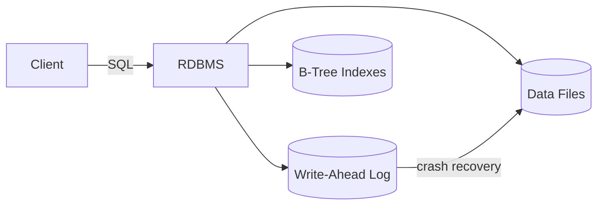
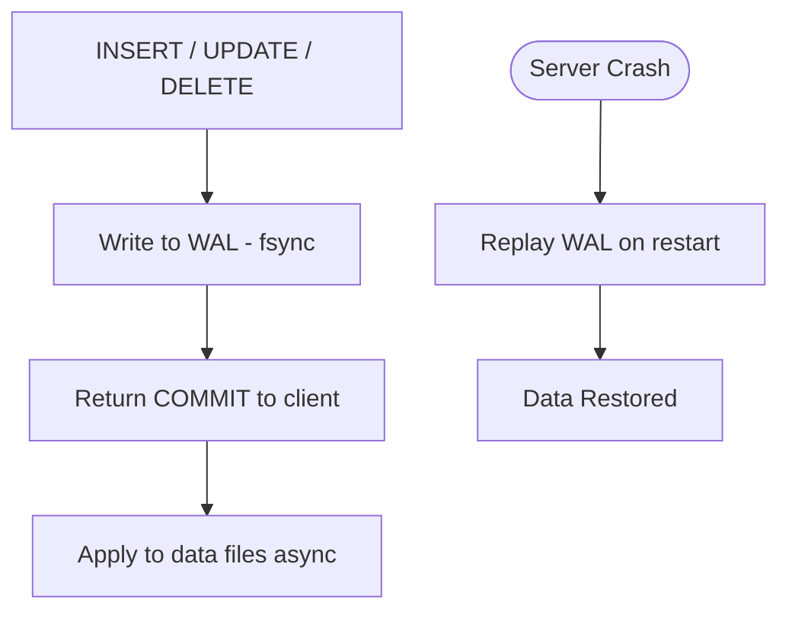
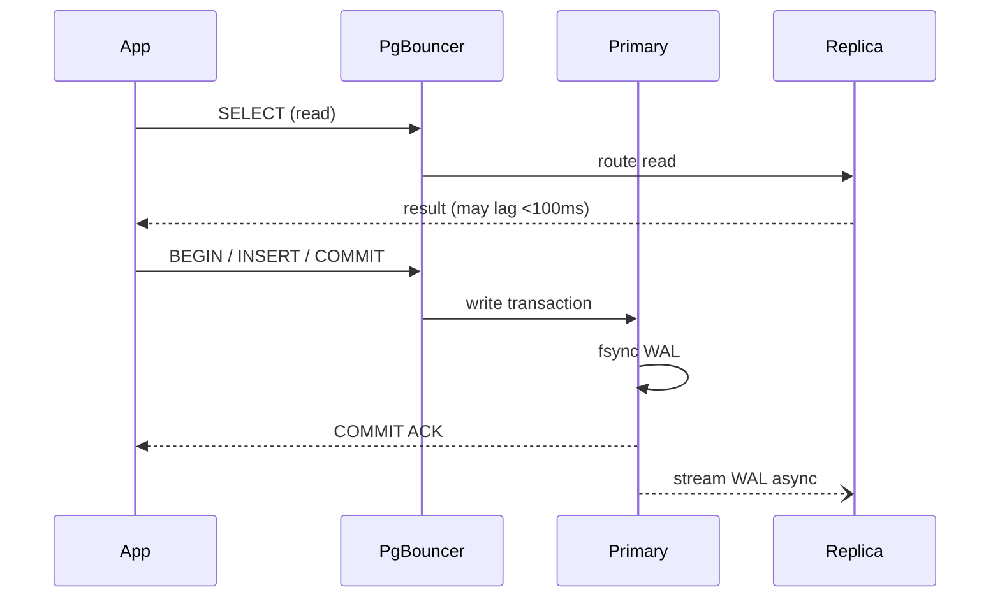
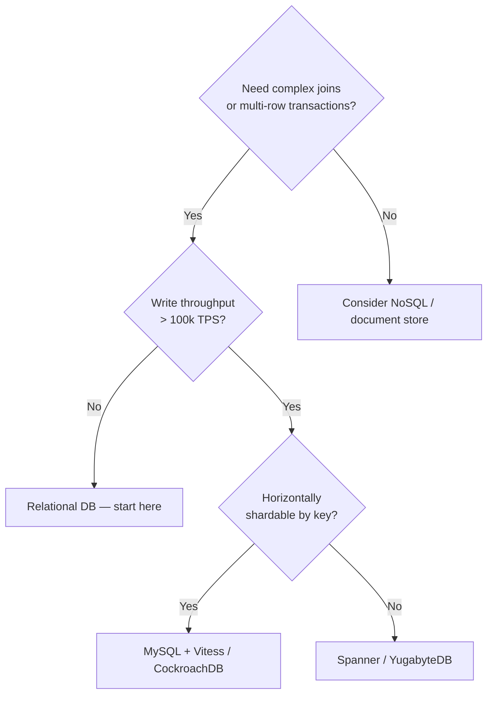

<!-- tldr -->
# Relational Databases

An RDBMS stores data in tables with fixed schemas, connects them via foreign keys, and enforces ACID properties on every transaction. It solves the two hardest problems in multi-user storage: concurrent writes corrupting shared state, and partial failures leaving data inconsistent. Every major FAANG-scale system either runs on a relational DB or had to explicitly justify why it didn't.



<!-- standard -->

## What It Is

A Relational Database Management System (RDBMS) organises data into **tables** (relations), each with typed columns and uniquely-keyed rows. Tables reference each other via **foreign keys**; the engine enforces **referential integrity** at write time. SQL is a declarative query language: you describe *what* you want, the query planner figures out *how* to fetch it.

Lineage: Edgar Codd's 1970 paper → SQL → PostgreSQL, MySQL, Oracle, SQL Server.

## Why It Matters

- **Race conditions** — two writes reading the same stale value and both "winning" — are prevented by the isolation subsystem.
- **Partial failures** (charge card, crash before updating order status) are prevented by atomicity + the Write-Ahead Log (WAL).
- **Schema constraints** (NOT NULL, UNIQUE, CHECK, FK) act as a second line of defence that no application bug can bypass.

## Primary Techniques

| Mechanism | What It Does |
|---|---|
| Primary key | Unique row identity; prefer stable integer/UUID over natural keys |
| Foreign key | References PK in another table; DB rejects orphaned rows |
| B-Tree index | O(log N) lookup vs O(N) full scan; 1ms vs ~500ms on 1M rows |
| Composite index | Multi-column index; **leftmost prefix rule** applies |
| Covering index | All query columns in the index; zero table access (index-only scan) |
| WAL | Append-only log written before data files; enables crash recovery |

## ACID in One Table

| Letter | Guarantee | Mechanism |
|---|---|---|
| Atomicity | All-or-nothing; partial writes rolled back | ROLLBACK / savepoints |
| Consistency | Constraints never violated | CHECK, FK, UNIQUE enforced on every write |
| Isolation | Concurrent txns don't see each other's partial state | MVCC / locking |
| Durability | Committed data survives crashes | WAL fsync before ACK |

## Isolation Levels vs. Anomalies

| Level | Dirty Read | Non-Repeatable Read | Phantom Read | Default In |
|---|---|---|---|---|
| Read Uncommitted | ✅ possible | ✅ | ✅ | — |
| Read Committed | ❌ | ✅ | ✅ | PostgreSQL, Oracle |
| Repeatable Read | ❌ | ❌ | ✅ | MySQL InnoDB |
| Serializable | ❌ | ❌ | ❌ | Explicit opt-in |

## Key Tradeoffs

- More indexes → faster reads, slower writes. A table with 10 indexes pays 10 B-Tree update costs per `INSERT`.
- Higher isolation → safer concurrency, more lock contention and lower throughput.
- Normalization → no redundancy, more joins. Denormalization → faster reads, harder to keep consistent.



<!-- deep -->

## Algorithms & Internals

### B-Tree Index

A B-Tree of order *d* keeps every leaf at the same depth. For *N* rows, lookup = **O(log_d N)** node reads. PostgreSQL uses *d* ≈ 100–400 per page (8 KB pages). At 1M rows: **3–4 I/Os**. At 1B rows: **5–6 I/Os**. This is why even billion-row tables respond to indexed point lookups in single-digit milliseconds.

```
Root:       [ J · P ]
            /   |   \
Level 1: [C·F] [L·N] [R·V]
Leaves:  A–B  C–E  F–I  J–K  L–M  N–O  P–Q  R–Z  → row pointers
```

### MVCC (Multi-Version Concurrency Control)

PostgreSQL and MySQL InnoDB implement isolation via MVCC rather than reader-writer locks:
- Each row stores `xmin` (transaction that created it) and `xmax` (transaction that deleted it).
- A `SELECT` sees only rows where `xmin ≤ snapshot_txid < xmax`.
- Writers create a new row version; readers never block writers and vice versa.
- Old versions are reclaimed by **VACUUM** (PostgreSQL) or the purge thread (InnoDB).

**Bloat risk**: if VACUUM lags behind write rate, dead row versions accumulate → table bloat → slower sequential scans. Monitor `n_dead_tup` in `pg_stat_user_tables`.

### Write-Ahead Log (WAL)

```
fsync(WAL entry) → return COMMIT → [async] write data page
```

**WAL amplification**: every `UPDATE` in PostgreSQL writes: (1) WAL record, (2) new heap page, (3) updated index pages. On NVMe this costs ~50–200 µs. On spinning disk, fsync can cost 5–10 ms → cap at ~100–200 TPS per disk without a battery-backed write cache.

---

## Real-World Systems

| System | How It Uses Relational Concepts |
|---|---|
| **PostgreSQL** | Full ACID, MVCC, JSONB for semi-structured data, logical replication |
| **MySQL InnoDB** | Repeatable Read default, gap locks to prevent phantoms, binlog replication |
| **CockroachDB** | Distributed SQL; Raft consensus per range; serializable by default |
| **Google Spanner** | Globally distributed RDBMS; TrueTime for external consistency; ~5–10ms external reads |
| **Amazon Aurora** | Shared storage layer; 6-way replication; WAL shipped to storage nodes, not full pages |
| **PlanetScale** | MySQL-compatible; Vitess sharding; schema changes via online DDL |

---

## Scaling Patterns

### Read Replicas
- Stream WAL (logical or physical) to one or more replicas.
- Reads scale horizontally; writes still bottleneck on the primary.
- **Replication lag**: typically < 100ms on same-region replicas; can reach seconds under write bursts. Reads that require strong consistency must go to primary.

### Sharding (Horizontal Partitioning)
- Split rows across multiple DB instances by a **shard key** (e.g., `user_id % N`).
- Cross-shard joins require application-level scatter-gather — expensive.
- **Hotspot risk**: time-based or monotonic shard keys concentrate writes on one shard. Prefer hash-based keys.
- Re-sharding is painful; plan capacity at 2–3× current load.

### Connection Pooling
- Each PostgreSQL connection = ~5–10 MB RAM + a backend process.
- At 10k concurrent users, direct connections are infeasible.
- **PgBouncer** (transaction-mode pooling) multiplexes thousands of app connections onto ~100 DB connections. P99 connection acquisition < 1ms.

### Vertical Scaling Ceiling
- A single PostgreSQL primary on a 96-vCPU, 768 GB RAM instance handles roughly **50k–100k simple QPS** before write contention saturates.
- Beyond that: read replicas, caching (Redis), or re-evaluate whether a relational model is the right fit.



---

## Failure Modes

| Failure | Symptom | Mitigation |
|---|---|---|
| Missing index | Full table scan; query P99 spikes from 2ms → 30s under load | `EXPLAIN ANALYZE`; composite index on filter columns |
| N+1 queries | DB QPS = page_views × N; CPU pegged | Eager-load with JOIN or `IN (...)` |
| Replication lag | Read replica returns stale data | Route strong-consistency reads to primary; monitor lag |
| Lock contention | Txns queue behind long-running write; latency spikes | Keep transactions short; avoid user interaction inside a txn |
| Table bloat (PG) | Dead row versions accumulate; scans slow | Tune `autovacuum`; alert on `n_dead_tup > 10%` |
| Connection exhaustion | `FATAL: too many connections` | PgBouncer; set `max_connections` conservatively |
| Split-brain (failover) | Two primaries accept writes; divergent state | Use a single arbiter (Patroni + etcd); fence the old primary |

---

## Capacity & Latency Reference Numbers

| Operation | Typical P99 |
|---|---|
| Indexed point read (NVMe, warm cache) | < 1 ms |
| Indexed range scan (1k rows) | 2–5 ms |
| Full table scan, 1M rows (no index) | 400–600 ms |
| `INSERT` with 5 indexes (NVMe, sync commit) | 1–3 ms |
| Cross-region read (same cloud provider) | 30–80 ms |
| Spanner global transaction | 5–15 ms (TrueTime commit wait) |

---

## Interview Pitfalls

1. **"Just add an index"** — indexes hurt write throughput. Explain the tradeoff and show you'd use `EXPLAIN ANALYZE` to confirm the plan.
2. **Conflating isolation level with consistency** — isolation is about concurrent transaction visibility; consistency is about constraint enforcement. They are separate axes.
3. **Forgetting leftmost prefix rule** — `INDEX(a, b)` does *not* help a `WHERE b = ?` query. Interviewers test this explicitly.
4. **Sharding too early** — most FAANG-scale problems are solved with read replicas + caching long before sharding is needed. Shard only when the write path is the bottleneck.
5. **Long transactions with user-facing waits** — holding a transaction open while waiting for an HTTP call or user input causes lock escalation and replica lag.
6. **SELECT \* in production paths** — fetches all columns including large blobs; network and memory cost at scale is non-trivial.

---

## "When to Reach for This" Decision Rubric



**Start with a relational database** when:
- Data has clear relationships and constraints matter.
- You need multi-row atomic writes (financial ledgers, inventory, reservations).
- Query patterns are not yet known — SQL's flexibility is invaluable early.
- Team size < 50 engineers; operational complexity of sharding outweighs benefit.

**Consider alternatives** when:
- Schema is truly dynamic per row → document store (MongoDB).
- Access pattern is pure key-value at > 1M QPS → DynamoDB / Redis.
- Time-series at high ingest rate → InfluxDB / TimescaleDB.
- Graph traversals > 3 hops dominate → Neo4j.